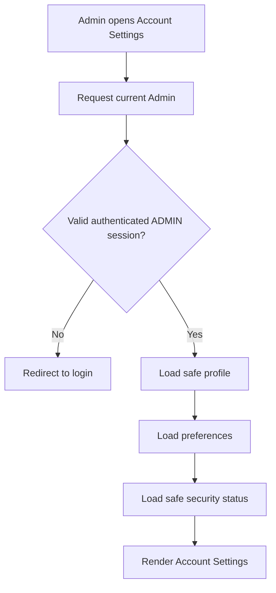
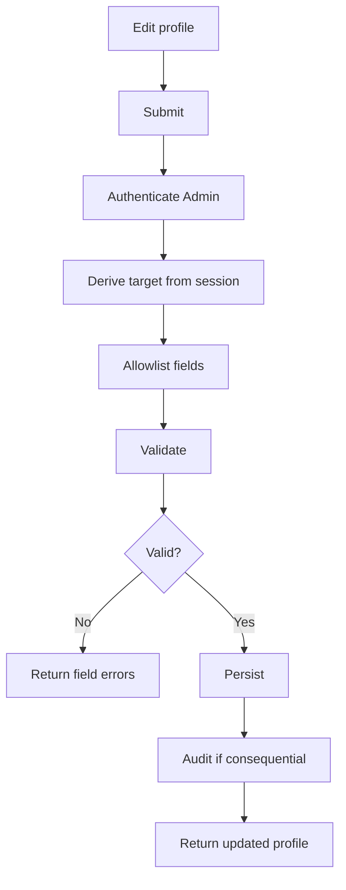
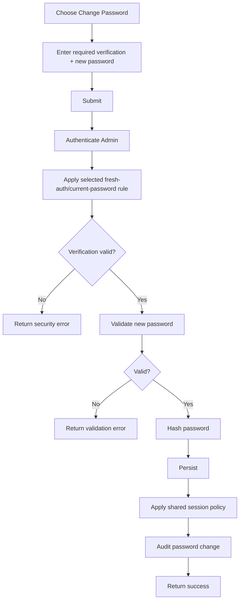
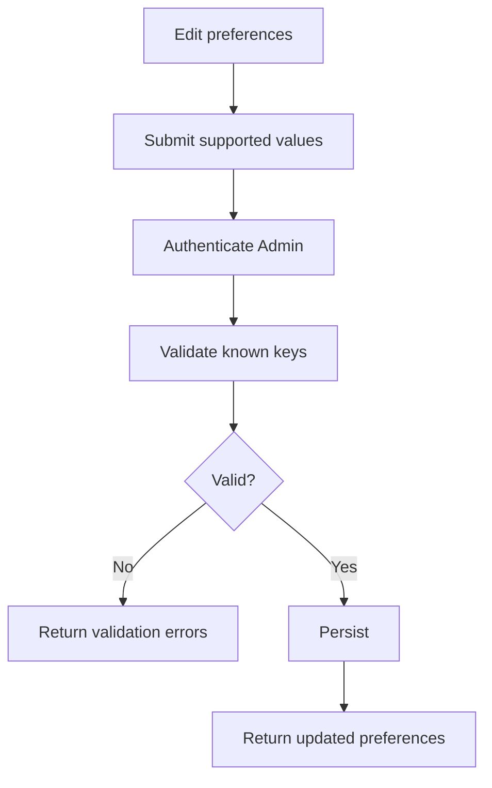
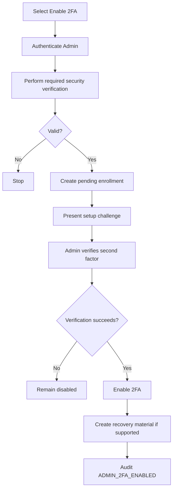
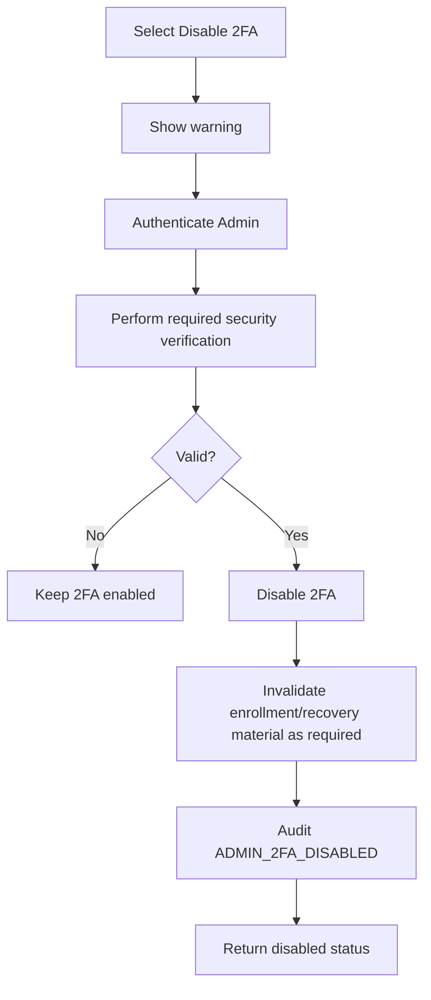
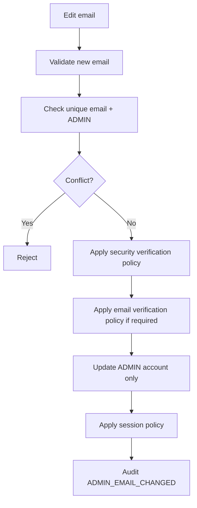
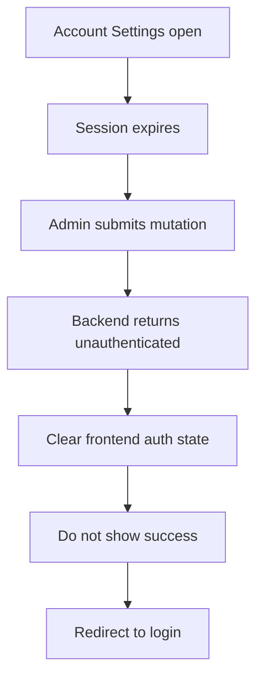
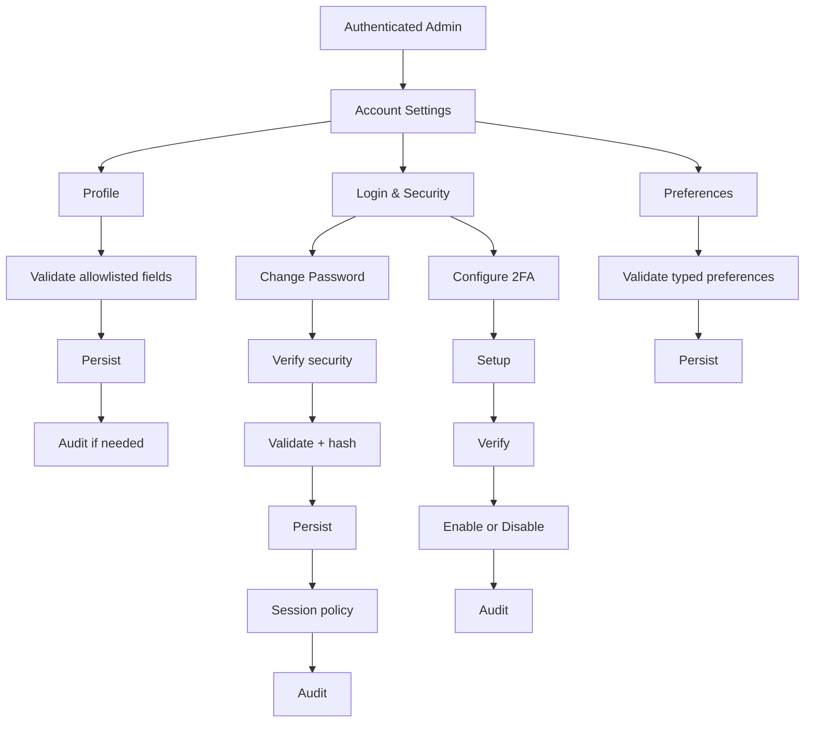

# Admin Account Management Flow

**System:** AISLEY  
**Feature:** Admin Account Management  
**Status:** Draft  
**Basis:** `Admin.md`, `app.md`, `specs.md`

---

## 1. Purpose

This file contains the sequence-heavy behavior intentionally removed from `specs.md`.

It covers:

- opening Account Settings
- profile update
- password change
- preference update
- 2FA enable/disable
- email change if supported
- session expiration
- Audit Log handoff

---

## 2. Entry Flow



Rule:

```text
target account = authenticated Admin
```

Never:

```text
target account = client-provided user_id
```

---

## 3. Profile Update Flow



Cross-role rule:

```text
ADMIN row changes
SELLER/BUYER/etc. rows remain unchanged
```

---

## 4. Password Change Flow



Never audit or log:

```text
old password
new password
password hash
```

---

## 5. Preferences Flow



Preferences never modify:

```text
role
permissions
status
```

---

## 6. 2FA Enable Flow

The exact 2FA method is still undecided.

Generic flow:



Important:

```text
setup started
    ≠
2FA enabled
```

---

## 7. 2FA Disable Flow



Exact verification/recovery behavior is Open.

---

## 8. Admin Auth Handoff

After 2FA becomes enabled:

```text
Account Management
    configures 2FA state
        ↓
Admin Auth
    reads that state during future login
        ↓
Admin Auth
    performs the selected 2FA challenge
```

---

## 9. Email Change Flow

Only applies if email editing is implemented.



Same-email accounts under other roles remain unchanged.

---

## 10. Session Expiration Flow



---

## 11. Forbidden Field Flow

Example malicious payload:

```json
{
  "name": "Admin",
  "role": "SUPER_ADMIN",
  "permissions": ["*"]
}
```

Backend:

```text
authenticate
    ↓
derive self target
    ↓
allowlist editable fields
    ↓
role/permissions rejected or ignored
    ↓
no authorization change
```

---

## 12. Audit Handoff

For consequential changes:

```text
mutation commits
    ↓
safe Audit event emitted
    ↓
shared Audit infrastructure
    ↓
actor + action + safe diff + time
```

No secret data enters the Audit payload.

---

## 13. Complete Flow



---

## 14. Related Features

```text
Admin Auth
    login/session/2FA enforcement

System Audit Logs
    security-change accountability

Admin Governance
    other Admins and custom permissions

Manage User Accounts
    Buyer/Seller/Logistics/Courier accounts

Platform Settings
    global platform settings/content
```

---

## 15. Open Flow Decisions

The flow remains intentionally generic until AISLEY decides:

- whether email is editable
- email verification requirements
- current-password confirmation
- fresh-auth timing
- password-change session invalidation
- exact 2FA method
- 2FA recovery
- exact preference set
- security-change email alerts
