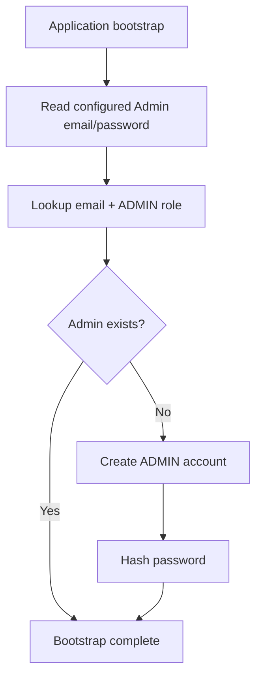
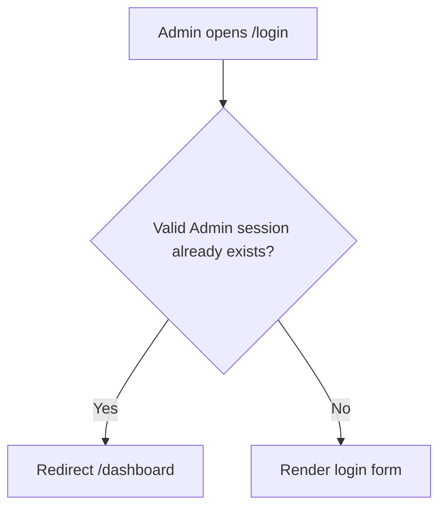
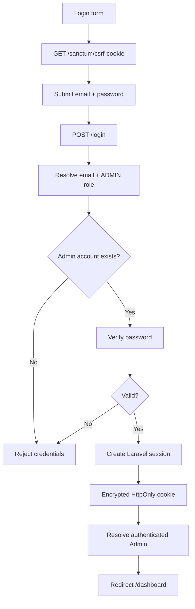
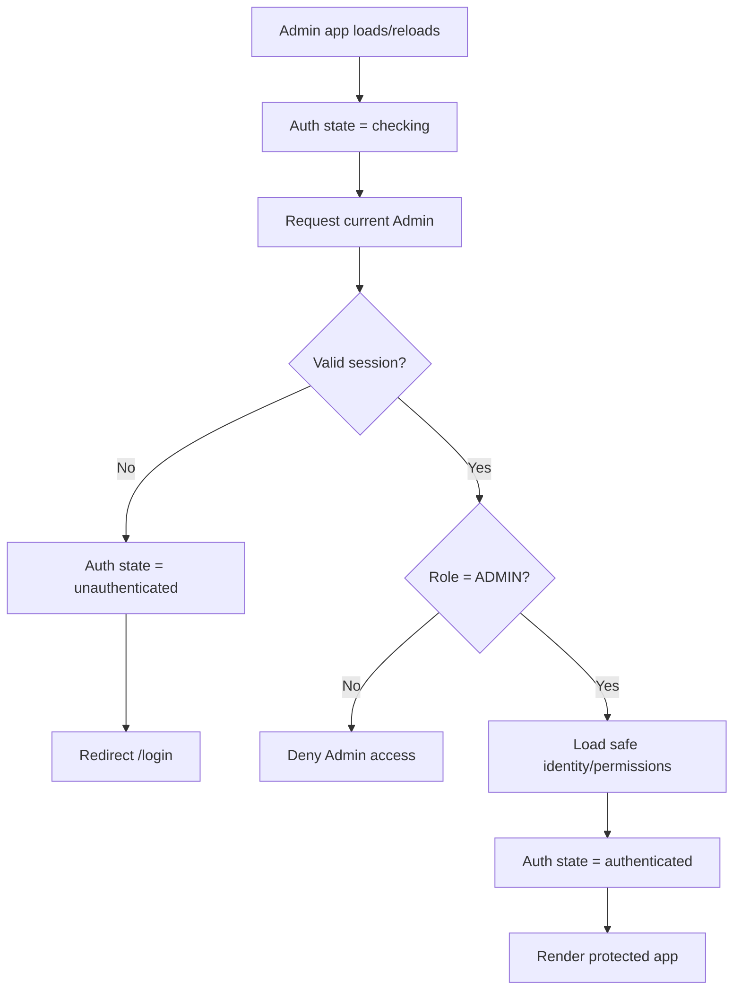
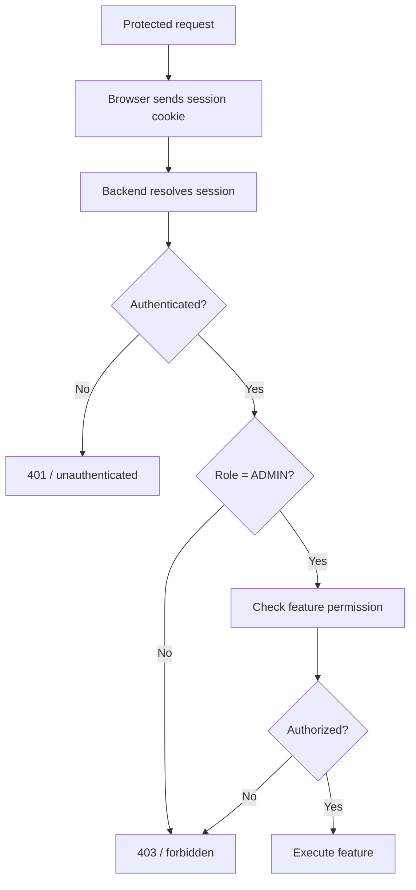
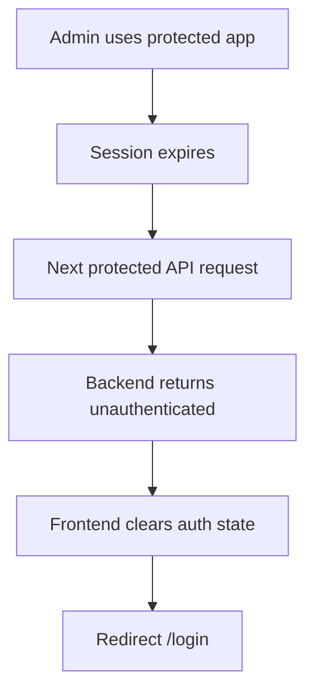
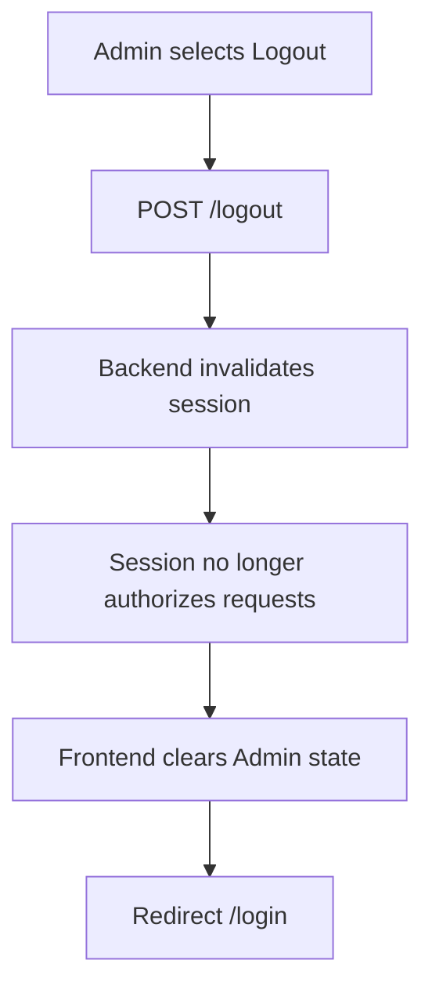
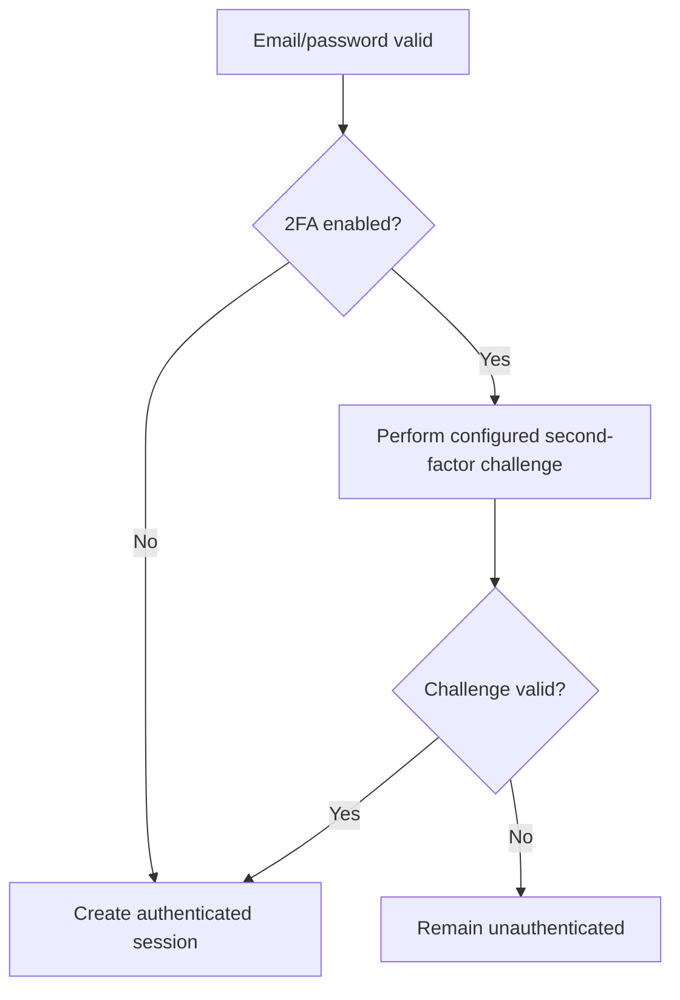
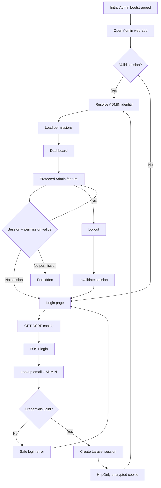

# Admin Authentication Flow

**System:** AISLEY  
**Feature:** Admin Authentication  
**Status:** Draft  
**Basis:** `app.md`, `Admin.md`, `specs.md`

---

## 1. Purpose

This file contains the sequence/state behavior for Admin Auth.

It covers:

- initial Admin bootstrap
- login
- CSRF initialization
- role-aware account lookup
- session creation
- session restoration
- protected routes
- authorization handoff
- session expiration
- logout
- future 2FA insertion point

Requirements remain authoritative in `specs.md`.

---

## 2. Initial Admin Bootstrap



Rules:

```text
lookup = email + ADMIN
bootstrap is idempotent
same-email non-Admin account does not satisfy lookup
```

---

## 3. Login Entry



---

## 4. Login Flow



---

## 5. Login Decision

```text
submitted email/password
    ↓
find:
    email = submitted email
    role = ADMIN
    ↓
record exists?
    ├── no  → deny
    └── yes
          ↓
      password valid?
          ├── no  → deny
          └── yes → establish session
```

---

## 6. Same Email Across Roles

Example:

```text
person@example.com + BUYER
person@example.com + SELLER
person@example.com + ADMIN
```

Admin login:

```text
submitted email
    ↓
ADMIN-scoped lookup
    ↓
only ADMIN password/identity can authenticate
```

Buyer/Seller credentials do not enter the Admin app.

---

## 7. Successful Login Result

```text
valid ADMIN credentials
    ↓
Laravel authenticated session
    ↓
encrypted HttpOnly session cookie
    ↓
browser sends cookie automatically
    ↓
Admin application
```

No web Bearer token needs to be stored in browser JavaScript storage.

---

## 8. Session Restoration



Do not render protected Admin content while authentication is still unresolved.

---

## 9. Protected Route Flow



---

## 10. Authentication vs Authorization

```text
Admin Auth
    ↓
authenticated ADMIN identity
    ↓
authorization middleware/policy
    ↓
feature permission
```

Auth does not grant every Admin every permission.

---

## 11. Dashboard Handoff

```text
successful login
    ↓
authenticated Admin
    ↓
/dashboard
```

Dashboard owns its own business data.

---

## 12. Session Expiration



---

## 13. Login Page with Existing Session

```text
/login
    ↓
valid Admin session?
    ├── yes → /dashboard
    └── no  → show login form
```

---

## 14. Logout



Frontend-only state clearing is not sufficient logout.

---

## 15. Logout Verification

After logout:

```text
old session
    ↓
protected request
    ↓
unauthenticated
```

---

## 16. Future 2FA Insertion Point

The exact 2FA method is not defined yet.

Future generic extension:



Do not implement a specific TOTP/SMS/email flow until the security mechanism is selected.

---

## 17. Error Paths

Invalid email/password:

```text
POST /login
    ↓
generic authentication failure
    ↓
remain on login page
```

Invalid/expired session:

```text
protected request
    ↓
401
    ↓
clear frontend auth state
    ↓
login
```

Authenticated but unauthorized:

```text
protected request
    ↓
403
    ↓
show forbidden/access-denied state
```

---

## 18. Cross-Feature Handoff

All protected Admin features depend on Auth:

```text
Admin Auth
    ↓
Admin Dashboard
    ↓
Account Approval
Manage User Accounts
Seller Compliance
Complaints & Disputes
Reports Overview
Admin Notifications
System Audit Logs
Platform Settings
Admin Account Management
Admin Chat / Messaging
Global Ban / Blocklist
Push Notification Management
```

Each feature performs its own authorization checks.

---

## 19. Web vs Mobile Auth Boundary

```text
ADMIN WEB
    Sanctum stateful session cookie
    HttpOnly
    CSRF

FLUTTER MOBILE
    personal access token
    Authorization: Bearer
```

This Auth flow covers Admin Web only.

---

## 20. Complete Flow



---

## 21. Open Flow Decisions

The source does not yet define:

- session lifetime
- idle timeout
- remember-me
- concurrent sessions
- login rate limits
- lockout behavior
- failed-login security logging
- 2FA mechanism/challenge
- forgot-password flow
- password-reset flow
- login history
- active-session management
- exact post-login return-route behavior
- Admin Global Ban behavior
