# Admin Chat / Messaging Flow

**System:** AISLEY  
**Feature:** Admin Chat / Messaging  
**Status:** Draft  
**Basis:** `Admin.md`, related role messaging sources, `specs.md`

---

## 1. Purpose

This file contains the sequence-heavy behavior removed from `specs.md`.

It covers:

- opening the Admin inbox
- initiating a thread
- replying to a thread
- read receipts
- unread state
- real-time delivery/recovery
- compliance and complaint handoffs
- archive behavior if implemented

---

## 2. Inbox Entry

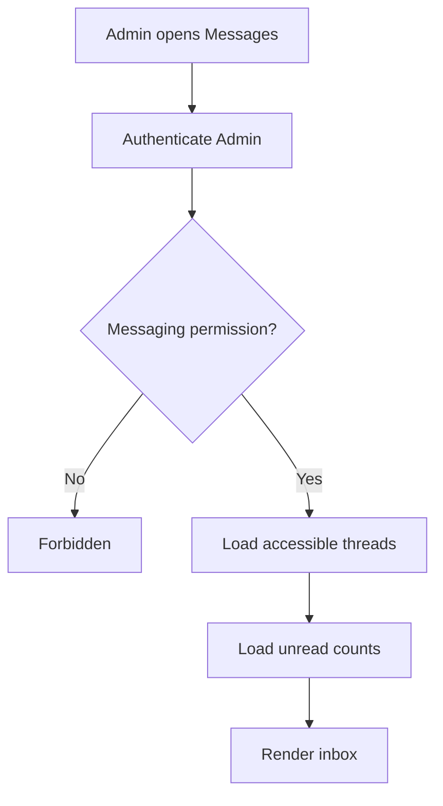

---

## 3. Start New Thread

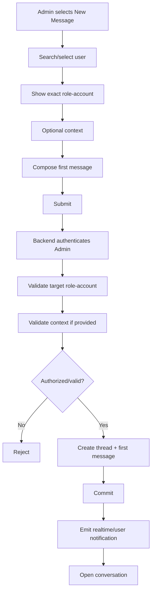

Important:

```text
target = user_id + role context
not email alone
```

---

## 4. Existing Thread Reply

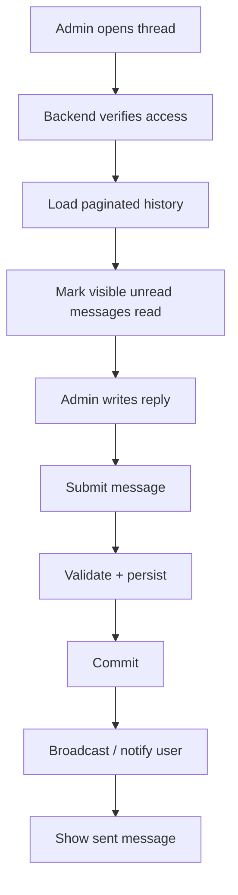

---

## 5. User Reply

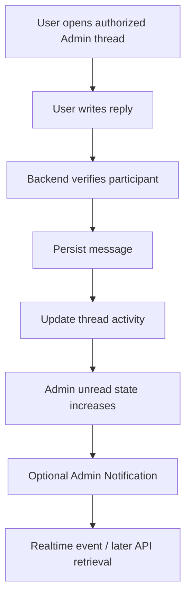

---

## 6. Read Receipt Flow

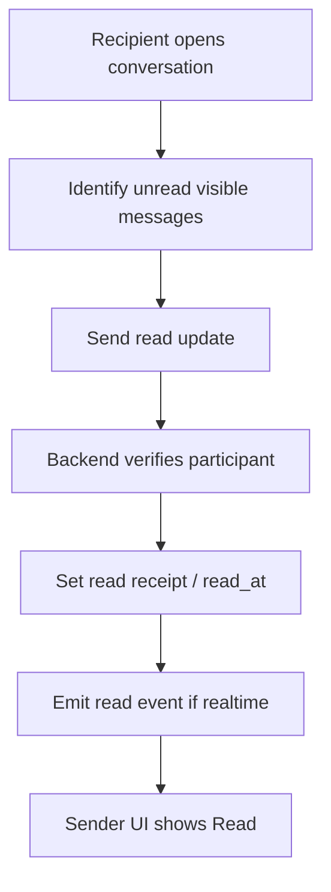

Read updates are idempotent.

Opening the inbox alone should not automatically mark every thread read.

---

## 7. Same Email Across Roles

```text
alex@example.com + BUYER
alex@example.com + SELLER
```

Admin selects Seller:

```text
Seller user_id
    ↓
thread created for Seller account
    ↓
Buyer account has no participant access
```

---

## 8. Compliance Handoff

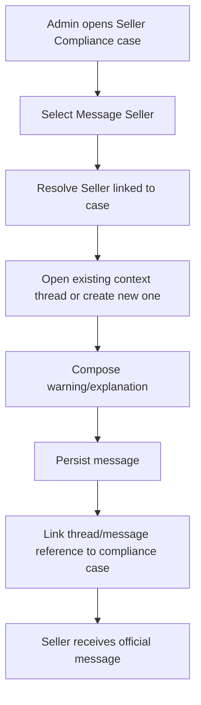

Messaging does not perform the suspension/removal itself.

---

## 9. Complaint Handoff

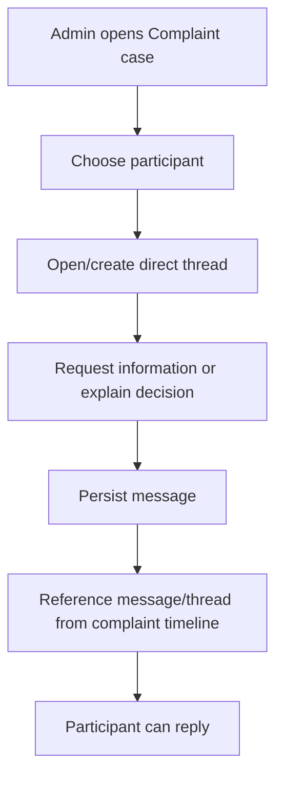

For multiple dispute parties:

```text
Admin ↔ Party A
Admin ↔ Party B
```

Use separate direct threads unless group chat is explicitly designed later.

---

## 10. Manage User Accounts Handoff

```text
User detail
    ↓
Message User
    ↓
exact role-account selected
    ↓
general/account-context Admin thread
```

---

## 11. Persistence Before Realtime

```text
authorize
    ↓
validate
    ↓
persist message
    ↓
commit transaction
    ↓
broadcast realtime event
    ↓
send optional notification
```

A realtime event is not the authoritative message store.

---

## 12. Broadcast Failure

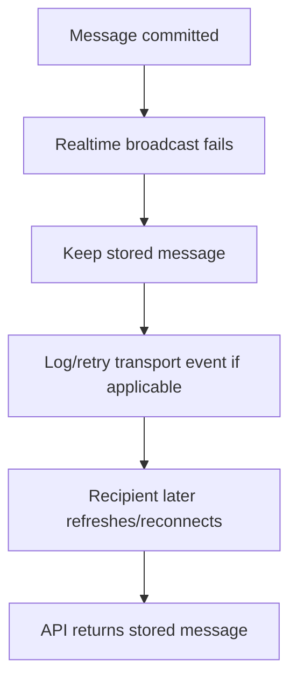

---

## 13. Persistence Failure

```text
message save fails
    ↓
do not broadcast as successful
    ↓
return send error
    ↓
keep draft available for retry
```

---

## 14. Reconnect Flow

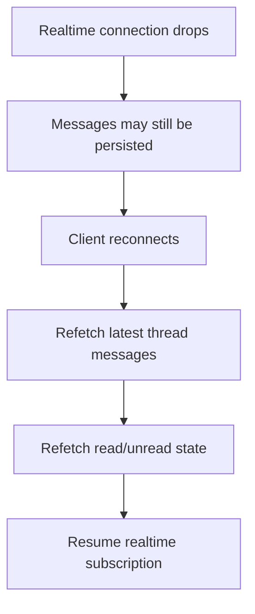

---

## 15. Offline User

```text
Admin sends message
    ↓
message persists
    ↓
user offline
    ↓
unread state remains
    ↓
user returns
    ↓
thread loads message
```

---

## 16. Offline Admin

```text
user replies
    ↓
message persists
    ↓
Admin offline
    ↓
Admin unread state remains
    ↓
Admin returns
    ↓
inbox shows unread thread
```

---

## 17. Archive Flow

Only if archive is implemented:

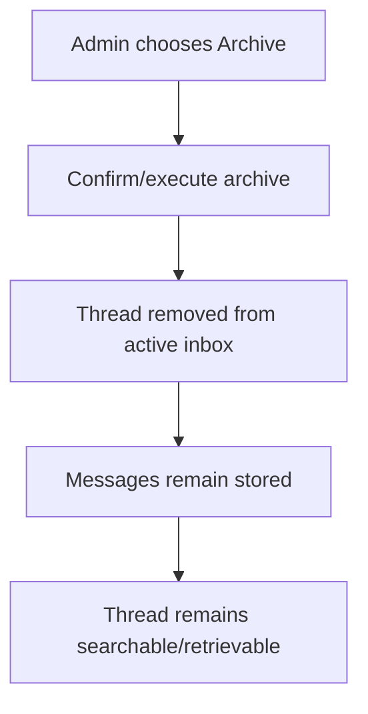

Archive never means hard delete.

---

## 18. Deactivated User

```text
user deactivated
    ↓
historical thread retained
    ↓
Admin may still read archive
    ↓
new-send ability follows account policy
```

---

## 19. Suspended User

Recommended but still Open:

```text
Seller suspended
    ↓
normal Seller operations restricted
    ↓
official compliance/support messaging may remain available
```

Exact limited-access policy must be decided separately.

---

## 20. Forbidden Access

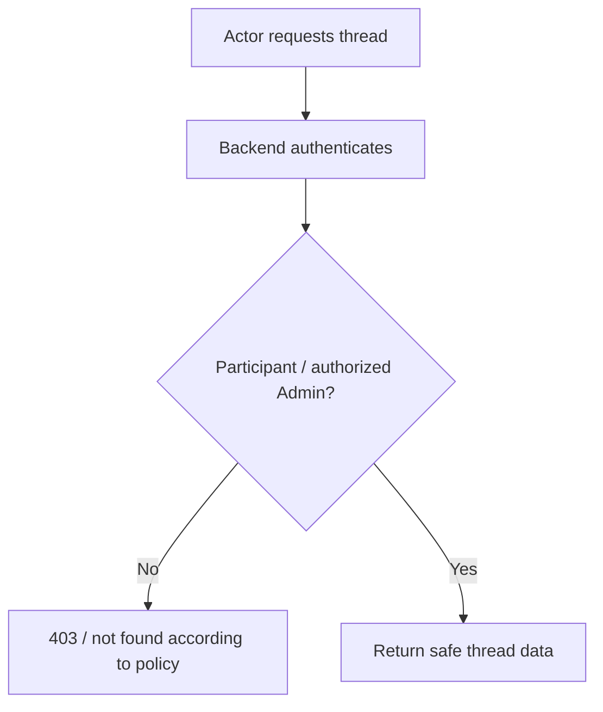

Thread IDs never grant access by themselves.

---

## 21. Message Safety

```text
submitted text
    ↓
validate length/non-empty
    ↓
store as data
    ↓
escape/sanitize on render
    ↓
no script execution
```

---

## 22. Audit Handoff

For consequential Admin messaging actions:

```text
Admin message/thread action commits
    ↓
emit safe Audit event
    ↓
Audit stores:
    actor Admin
    action
    thread id
    message id
    target user
    context
    timestamp
```

Do not copy full message content into Audit Logs by default.

---

## 23. Admin Notification Handoff

```text
user reply
    ↓
Messaging stores message
    ↓
Admin unread state updates
    ↓
optional ADMIN_MESSAGE_RECEIVED event
    ↓
Admin Notifications creates alert
    ↓
deep link back to thread
```

---

## 24. Complete Flow

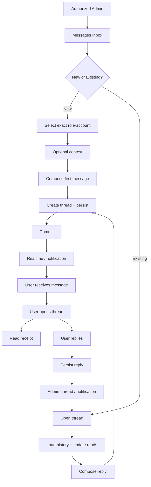

---

## 25. Open Flow Decisions

The exact flow still depends on:

- shared vs individually owned Admin threads
- user-initiated Admin support
- thread uniqueness rules
- exact read-receipt model
- archive behavior
- suspended/banned user access
- realtime provider
- duplicate-send/idempotency implementation
- external notification behavior
- attachment support
