# Global Ban / Blocklist Management Flow

**System:** AISLEY  
**Feature:** Global Ban / Blocklist Management  
**Status:** Draft  
**Basis:** `Admin.md`, `app.md`, `specs.md`

## 1. Purpose

This file contains the sequence-heavy behavior for:

- adding user/IP/payment blocks
- disabling/reactivating blocks
- request-time enforcement
- transaction-time payment enforcement
- cache synchronization
- Audit Log handoff

## 2. Admin Entry

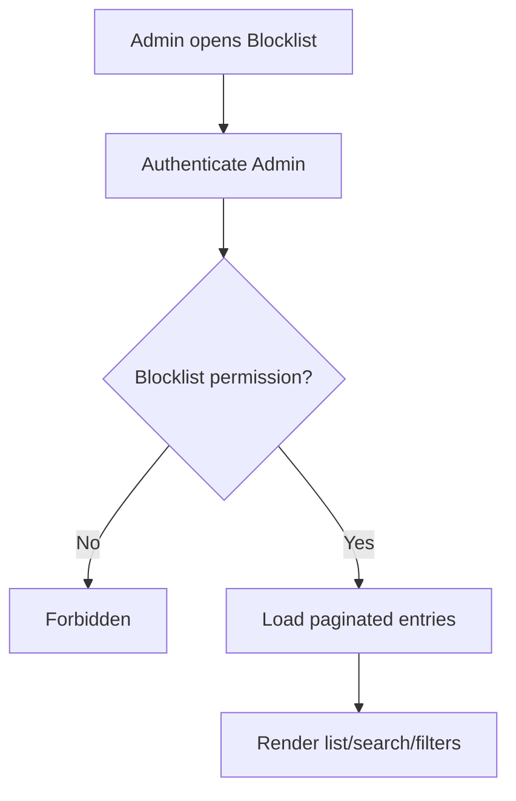

## 3. Add User Ban

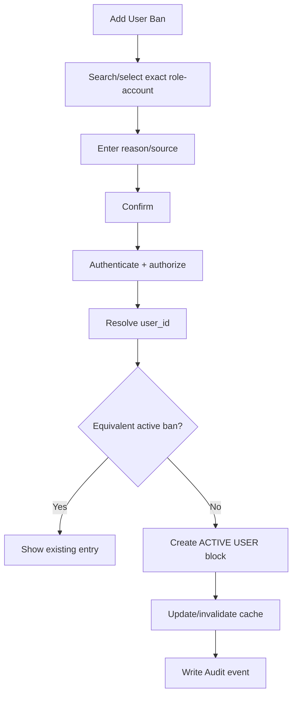

Target rule:

```text
user_id
not email alone
```

## 4. Same Email Across Roles

```text
alex@example.com + BUYER
alex@example.com + SELLER

Ban Seller user_id
→ Seller blocked
→ Buyer account unchanged
```

## 5. Add IP Block

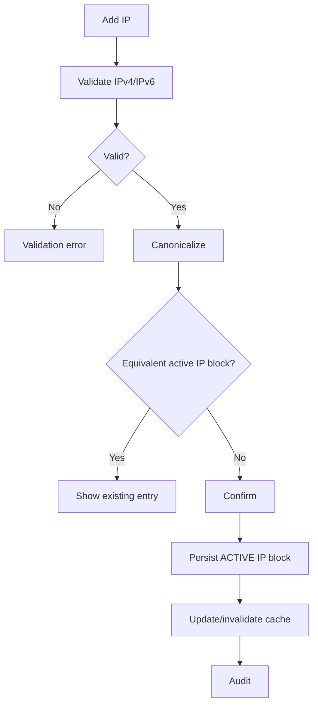

## 6. Add Payment Block

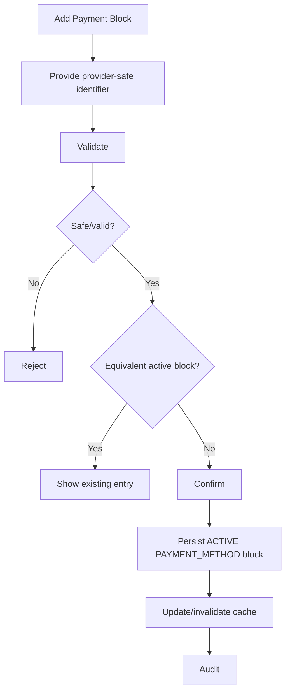

Never use:

```text
full card number
CVV
OTP
bank password
```

## 7. Disable Block

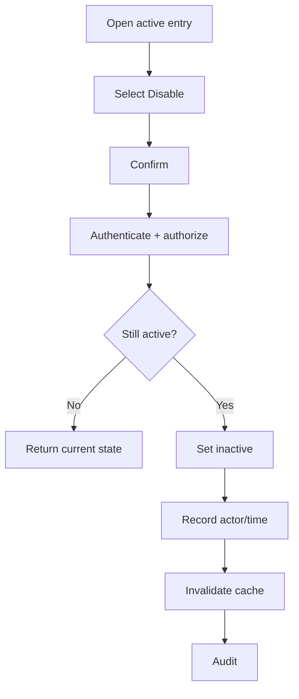

Disable preserves historical record.

## 8. Reactivate Block

If supported:

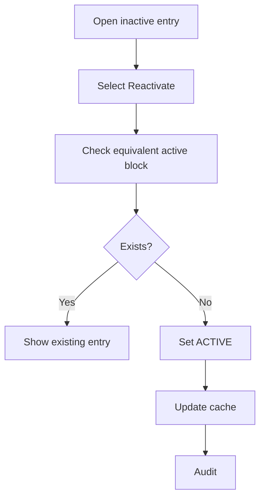

## 9. IP Enforcement

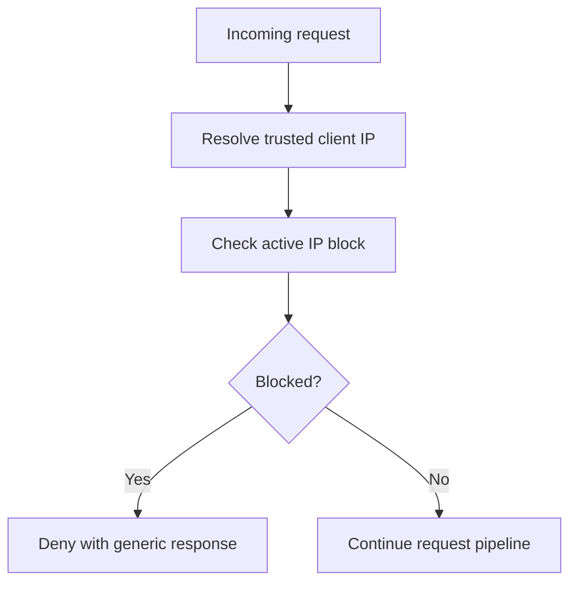

## 10. User Enforcement

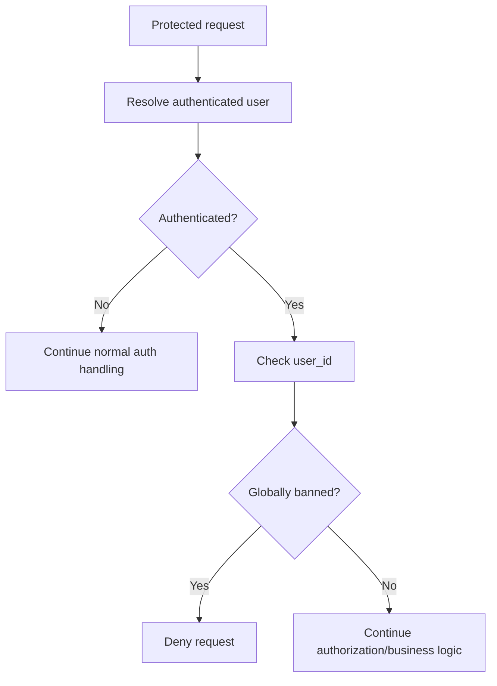

Existing session/token does not bypass this check.

## 11. Combined Request

```text
incoming request
→ trusted IP
→ IP blocked?
   yes → deny
   no  → continue
→ authenticate when required
→ authenticated user blocked?
   yes → deny
   no  → authorization/business logic
```

## 12. Payment Attempt

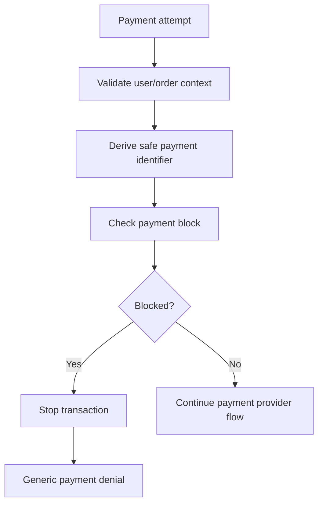

The backend check remains authoritative even if checkout loaded before the block was added.

## 13. Historical Payment

```text
block added now
→ future/applicable payment attempts denied

completed historical transactions
→ unchanged
```

## 14. Existing Session After User Ban

```text
user already logged in
→ Admin activates USER block
→ next protected request
→ Blocklist check
→ denied
```

Session/token revocation is optional/Open.

## 15. Independent Account State

```text
Account status = SUSPENDED
Global Ban = ACTIVE

disable Global Ban
→ Global Ban = INACTIVE
→ Account status remains SUSPENDED
```

## 16. Independent Compliance State

```text
Seller Compliance restriction = ACTIVE
Global Ban = ACTIVE

disable Global Ban
→ compliance restriction remains ACTIVE
```

## 17. Complaint Handoff

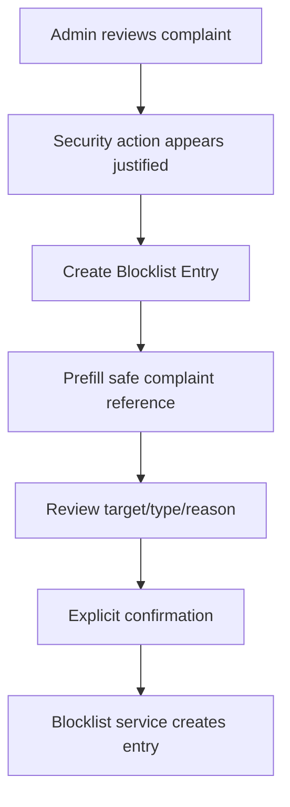

No automatic ban.

## 18. Compliance Handoff

```text
Compliance case
→ Admin explicitly chooses Global Ban
→ separate Blocklist permission/confirmation
→ block created
```

No automatic coupling.

## 19. Cache Lookup

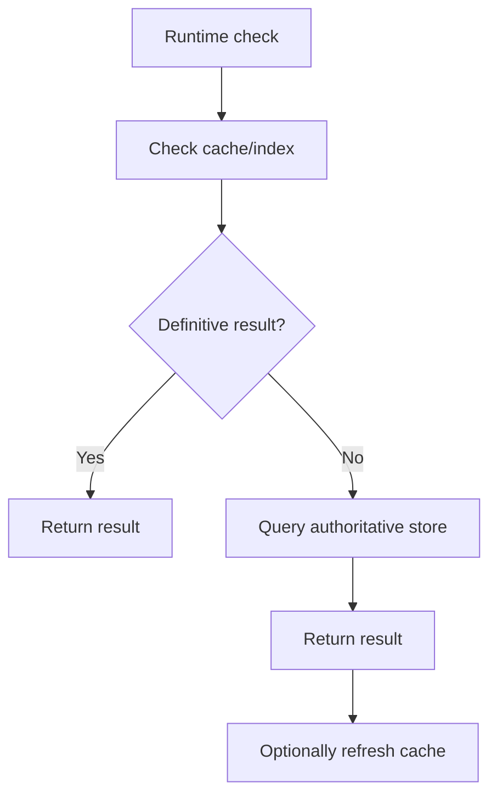

## 20. Cache Mutation Sync

```text
Admin mutation commits
→ durable Blocklist state changes
→ invalidate/update relevant cache
→ subsequent checks use new state
```

Cache is not the source of truth.

## 21. Cache Failure

```text
cache unavailable
→ configured fallback policy
```

Recommended:

```text
database fallback
```

Exact fail-open/fail-closed behavior is Open.

## 22. Runtime Match Logging

```text
blocked request/transaction
→ security/application log
→ aggregate monitoring
```

Do not create one Admin Audit event per runtime match.

## 23. Audit Handoff

```text
Admin add/disable/reactivate
→ mutation commits
→ safe Audit event
→ System Audit Logs records:
   actor
   action
   entry ID
   block type
   safe target
   timestamp
```

No payment secrets.

## 24. Duplicate Handling

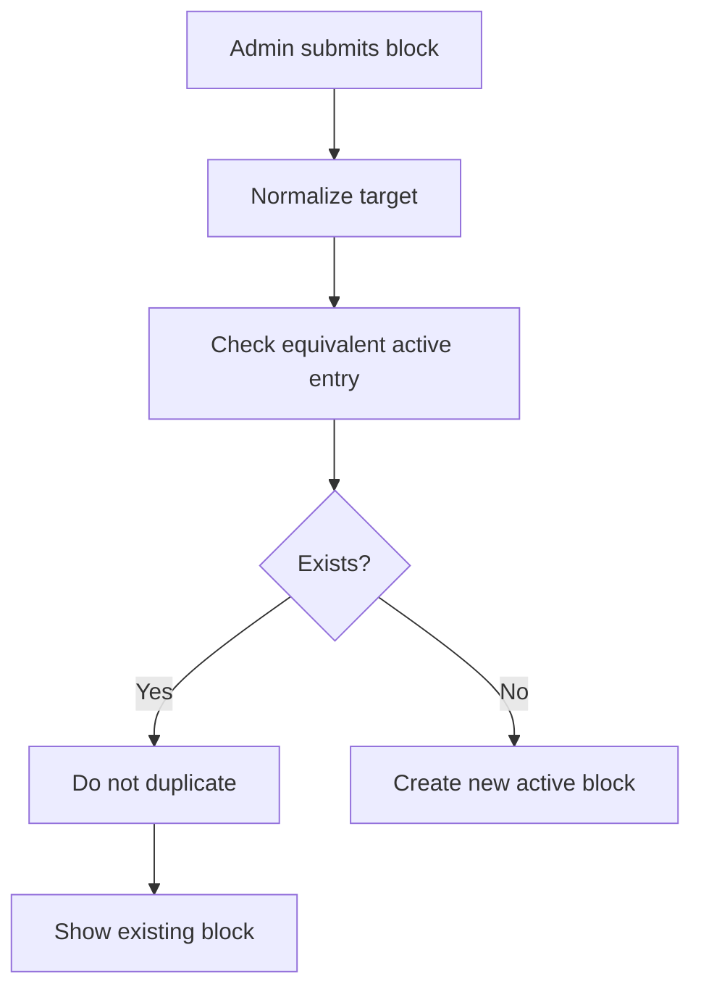

## 25. Blocked Response

```text
active match
→ deny access / transaction
→ generic message
```

Do not reveal:

```text
internal reason
fraud evidence
Admin creator
payment fingerprint
security notes
```

## 26. Complete Flow

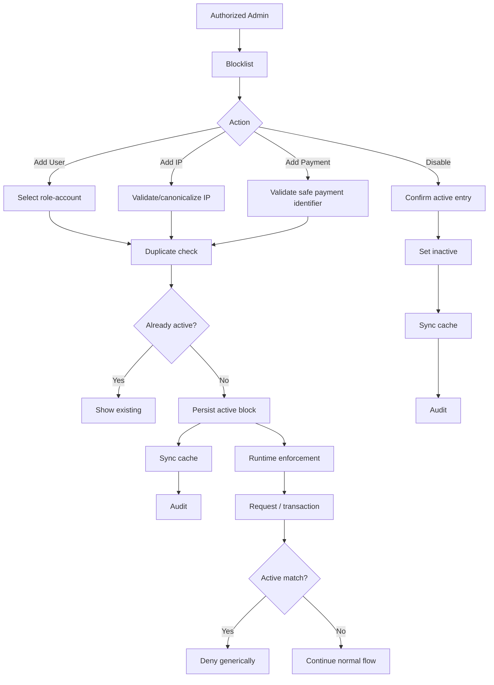

## 27. Open Flow Decisions

The exact flow still depends on:

- session/token revocation
- Admin-account ban policy
- IP route exclusions
- CIDR/range matching
- payment provider/fingerprint format
- COD behavior
- fail-open/fail-closed policy
- cache implementation
- reactivation
- banned-user support access
- active order/shipment/task handling
- security alert thresholds
