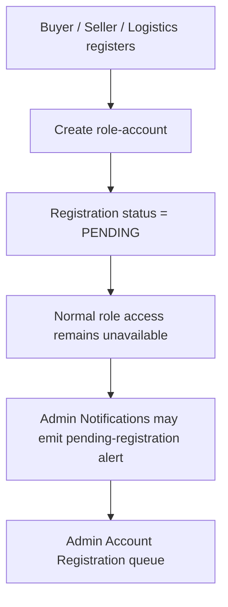
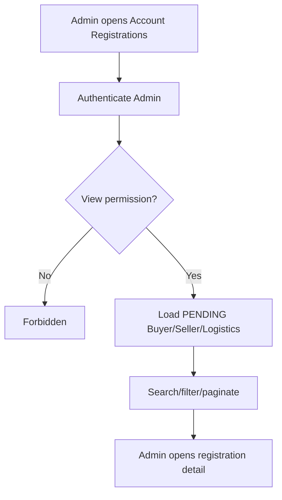
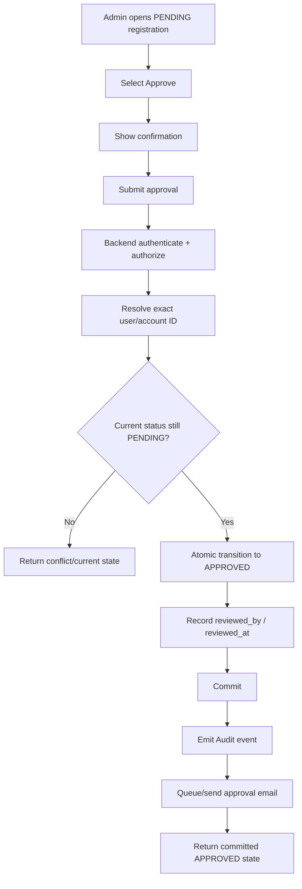
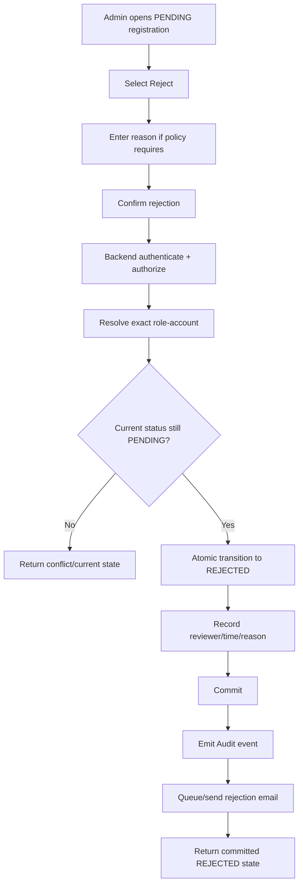
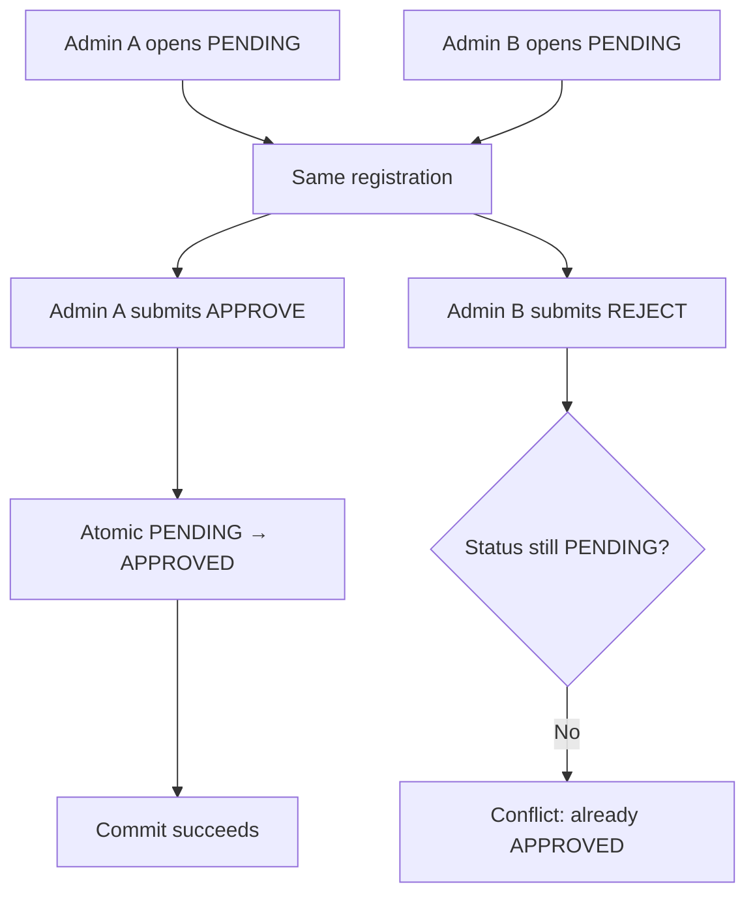
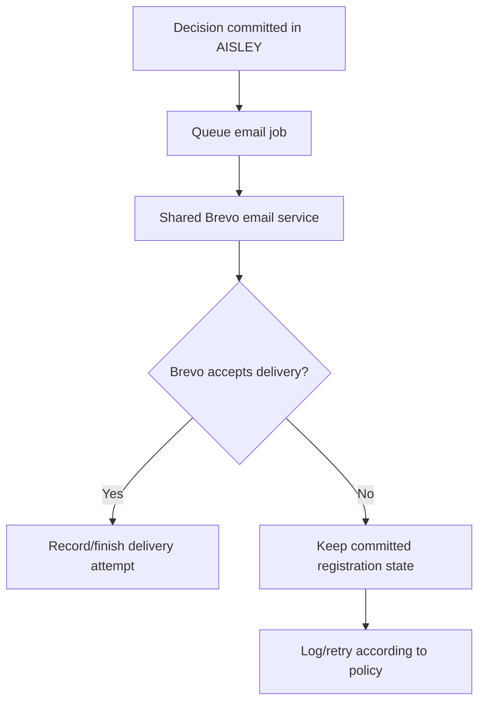
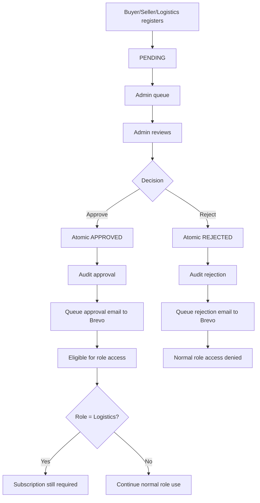

# Manage Account Registrations Flow

**System:** AISLEY  
**Feature:** Manage Account Registrations  
**Status:** Draft  
**Email Provider:** Brevo  
**Basis:** `Admin.md`, `app.md`, `specs.md`

## 1. Purpose

This file contains the sequence/state behavior for:

- registration submission handoff
- Admin queue
- approval
- rejection
- email notification
- concurrency handling
- Dashboard/Notification/Audit handoffs

## 2. Registration Ownership

```text
Buyer
→ Admin approval

Seller
→ Admin approval

Logistics
→ Admin approval

Courier
→ Logistics approval
```

Courier is outside this Admin flow.

## 3. Registration Entry



## 4. Admin Queue



## 5. Approval Flow



## 6. Approval Result by Role

```text
Buyer APPROVED
→ eligible for normal Buyer sign-in

Seller APPROVED
→ eligible for normal Seller sign-in

Logistics APPROVED
→ eligible for Logistics sign-in
→ subscription step still required
```

Important:

```text
Logistics APPROVED
≠
Logistics SUBSCRIBED
```

## 7. Rejection Flow



## 8. Same Email Across Roles

```text
alex@example.com + BUYER = PENDING
alex@example.com + SELLER = PENDING
```

Admin approves Seller:

```text
SELLER → APPROVED
BUYER → remains PENDING
```

Decision target is the exact account ID.

## 9. Concurrent Admin Decision



Only one final transition wins.

## 10. Email Delivery Boundary

Brevo is only the delivery transport.

```text
AISLEY
    owns approval/rejection decision

Brevo
    delivers the resulting email
```

Brevo never changes:

```text
PENDING
APPROVED
REJECTED
```

## 11. Email Failure Flow



Never:

```text
Brevo failure
→ roll back APPROVED / REJECTED
```

## 12. Approval Email Handoff

```text
APPROVED committed
→ queue email
→ shared Brevo integration
→ approval email
→ applicant inbox
```

For Logistics:

```text
APPROVED
≠
SUBSCRIBED
```

The message must not claim subscription is active.

## 13. Rejection Email Handoff

```text
REJECTED committed
→ queue email
→ shared Brevo integration
→ rejection email
→ applicant inbox
```

Reason/resubmission wording depends on future policy.

## 14. No Push/SMS Dependency

Manage Account Registrations does not require:

```text
Firebase
Twilio
AWS SNS
Push provider
SMS gateway
```

Current external dependency:

```text
Brevo for email delivery
```

## 13. Dashboard Handoff

```text
PENDING registration created
→ Dashboard Pending Registrations count increases

PENDING → APPROVED/REJECTED
→ pending count eventually decreases
```

Count includes:

```text
Buyer
Seller
Logistics
```

not Courier.

## 14. Admin Notifications Handoff

```text
new Admin-owned registration
→ ACCOUNT_REGISTRATION_PENDING event
→ Admin Notifications
→ deep link to registration
```

The decision remains owned by Manage Account Registrations.

## 15. Audit Handoff

```text
approval/rejection commits
→ safe Audit event
→ System Audit Logs records:
   Admin actor
   target user ID
   role
   previous status
   new status
   timestamp
```

No credentials/secrets.

## 16. Login Handoff

```text
PENDING
→ normal role access denied

REJECTED
→ normal role access denied

APPROVED
→ normal role access may proceed
   subject to role-specific requirements
```

For Logistics:

```text
APPROVED
→ sign in
→ subscription requirement
```

## 17. Invalid Re-Decision

```text
APPROVED
→ reject request arrives
→ reject as invalid/stale transition

REJECTED
→ approve request arrives
→ reject as invalid/stale transition
```

A future reconsideration workflow would need separate requirements.

## 18. Complete Flow



## 19. Open Flow Decisions

The exact flow still depends on:

- rejection-reason policy
- rejected-registration resubmission
- reconsideration/reopen flow
- email retry/resend UI
- exact login error for PENDING/REJECTED
- optional additional Seller/Logistics review data
- any future KYC/document-verification process
