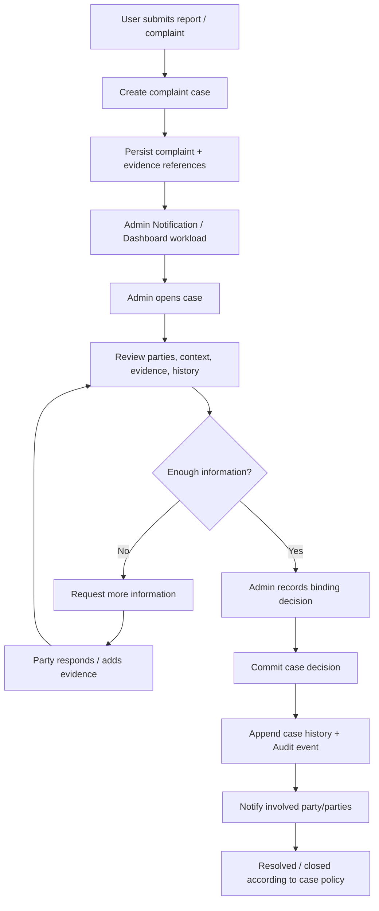
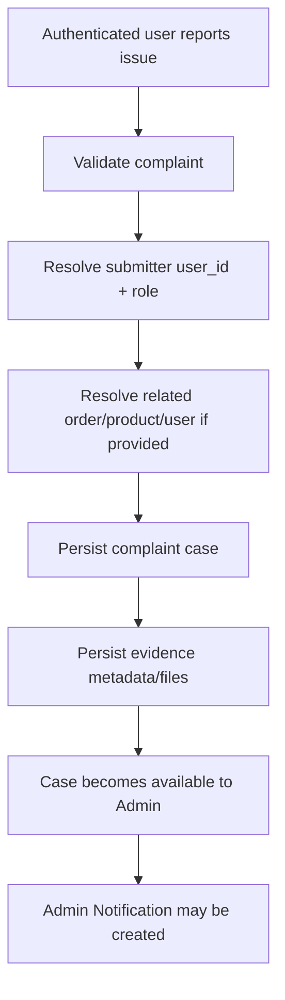
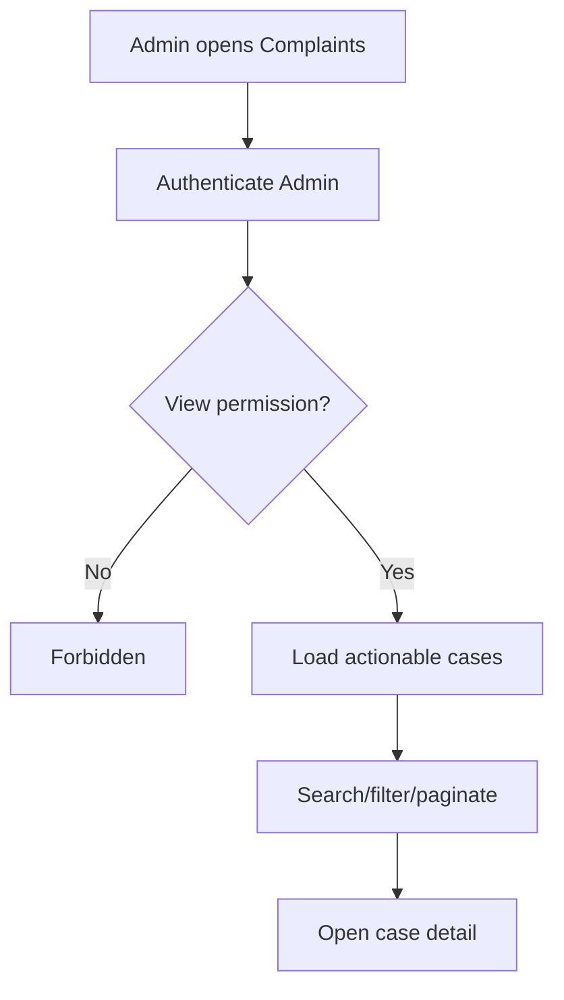
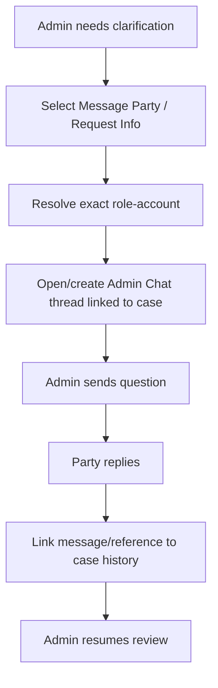
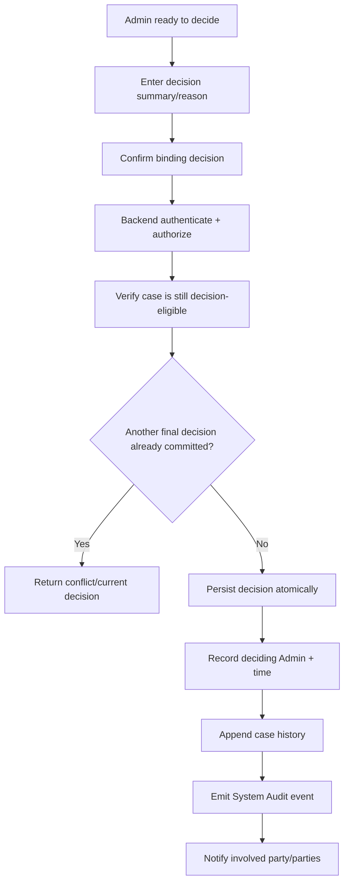
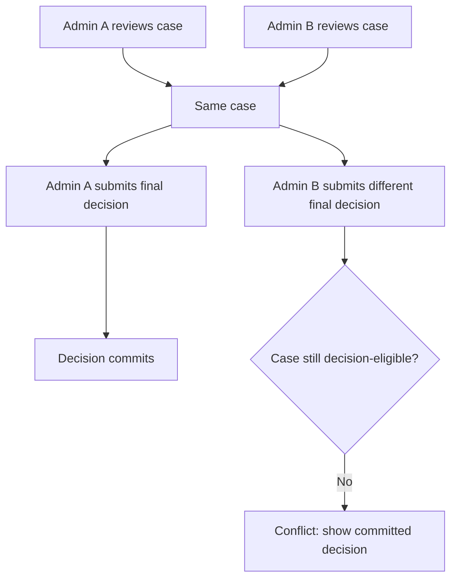
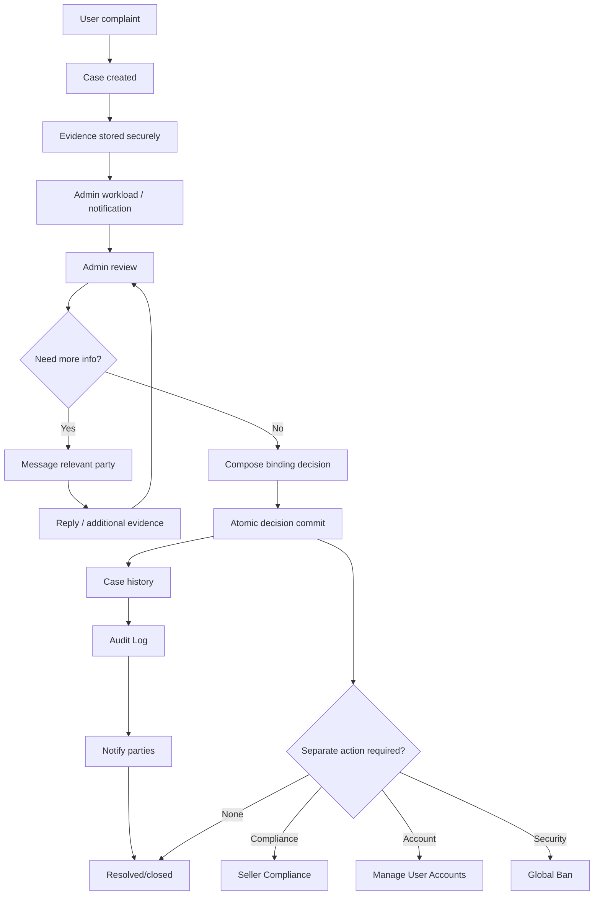

# Manage Complaints and Disputes Flow

**System:** AISLEY  
**Feature:** Manage Complaints and Disputes  
**Status:** Draft  
**Basis:** `Admin.md`, `specs.md`

## 1. Purpose

This file contains the sequence/state behavior for:

- complaint intake
- evidence handling
- Admin review
- requests for more information
- binding decision
- resolution/closure
- feature handoffs
- Audit Log integration
  Exact database status names remain Open because the source does not define them.

## 2. High-Level Case Flow



## 3. Logical State Progression

Source-backed logical stages:

```text
submitted
→ Admin review
→ binding decision
→ resolved
```

Exact enums such as:

```text
OPEN
IN_REVIEW
RESOLVED
CLOSED
```

are not mandated until implementation chooses them.

## 4. Complaint Intake



## 5. Evidence Upload

```text
user submits file
→ validate type/size
→ generate safe storage key
→ store privately
→ create evidence record linked to case
→ evidence becomes visible only through authorized retrieval
```

If storage fails:

```text
do not report evidence as attached
```

## 6. Admin Queue



## 7. Admin Review

```text
case detail
→ inspect complaint
→ inspect exact role-aware parties
→ inspect related entity
→ inspect evidence
→ inspect message/action history
→ determine whether information is sufficient
```

## 8. Request More Information

Recommended:



Messaging does not resolve the case.

## 9. Separate Party Privacy

For a two-party dispute:

```text
Admin ↔ Complainant
Admin ↔ Respondent
```

Use separate direct conversations unless future requirements explicitly permit a shared thread.

## 10. Decision Flow



## 11. Concurrent Admin Review



Do not silently overwrite.

## 12. Decision Notification Failure

```text
decision commits
→ external notification attempted
→ notification fails
→ keep binding decision
→ retry/log notification according to policy
```

Do not roll back the decision solely because notification delivery failed.

## 13. Complaint → Seller Compliance

If findings indicate Seller compliance action may be needed:

```text
Complaint decision/findings
→ explicit handoff to Seller Compliance
→ separate authorization/action
→ Compliance owns sanction state
```

No automatic suspension/product removal.

## 14. Complaint → Manage User Accounts

If an account action is warranted:

```text
Complaint case
→ explicit Manage User Accounts action
→ separate confirmation
→ account lifecycle feature owns suspension/deactivation
```

## 15. Complaint → Global Ban

```text
Complaint case
→ explicit Create Blocklist Entry
→ Global Ban permission/confirmation
→ Blocklist owns security restriction
```

No automatic ban.

## 16. Complaint → Financial Action

Current source does not define refund/compensation behavior.
Therefore:

```text
Complaint decision
≠
automatic refund
```

Any future financial operation must use a separately defined payment/refund flow.

## 17. Complaint → Order

```text
Complaint decision
≠
automatic order status mutation
```

Order/logistics state remains owned by its domain.

## 18. Audit Handoff

```text
binding Admin action commits
→ safe Audit event emitted
→ System Audit Logs records:
   Admin actor
   case ID
   action
   safe decision reference
   timestamp
```

Evidence binaries are not copied into Audit Logs.

## 19. Dashboard Handoff

```text
new actionable complaint
→ Dashboard Open Complaints may increase

case becomes non-actionable/resolved
→ Dashboard count eventually decreases
```

Exact actionable definition belongs to Complaints.

## 20. Admin Notification Handoff

```text
new complaint
→ Admin Notifications
→ safe complaint preview
→ deep link to case
```

The notification is not the case itself.

## 21. Resolved Case

After binding resolution:

```text
case remains historically retrievable
→ evidence remains subject to retention policy
→ messages/actions remain traceable
→ decision remains visible
```

Hard deletion is not the normal resolution path.

## 22. Complete Flow



## 23. Open Flow Decisions

The exact flow still depends on:

- exact case status enum
- complaint submission roles
- user-facing submission entry points
- decision vs closure distinction
- appeal/reopen
- party notification channel
- internal notes
- case assignment
- priority/SLA
- evidence retention
- financial/refund integration
- exact complaint-to-compliance/account/security handoff rules
