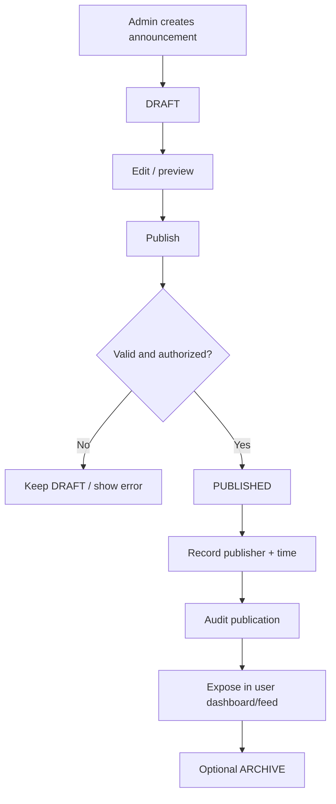
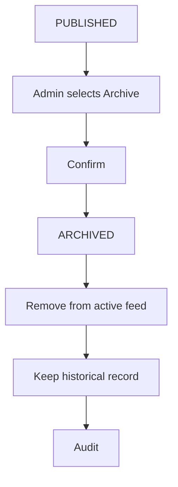
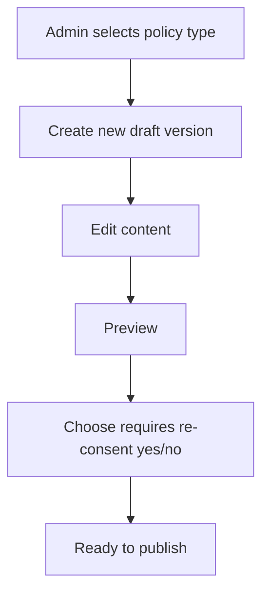
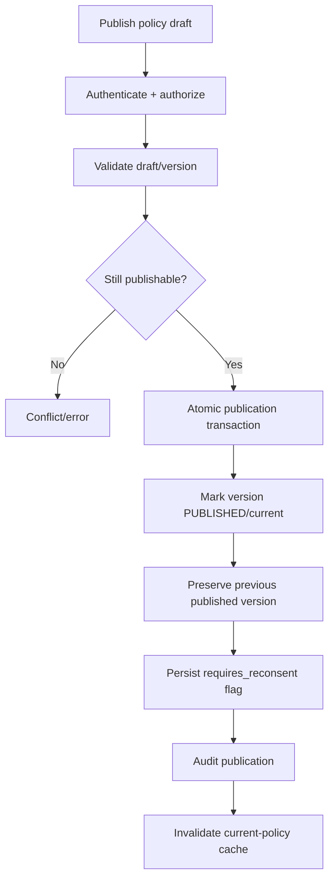
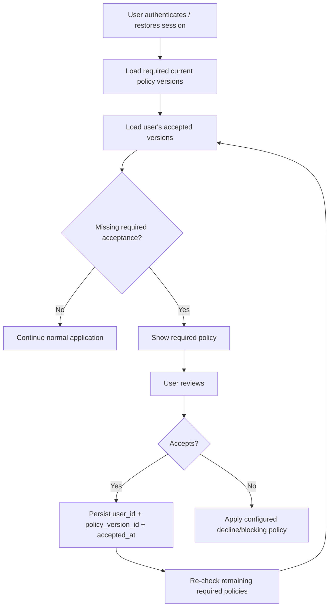
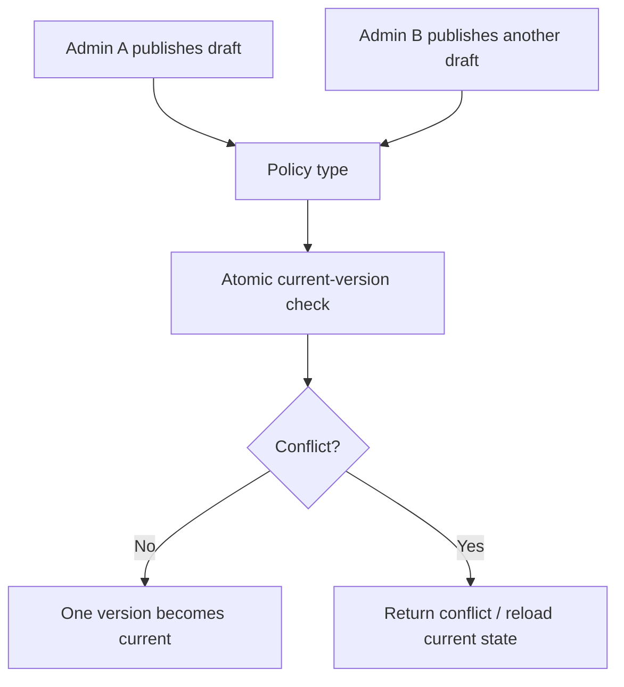
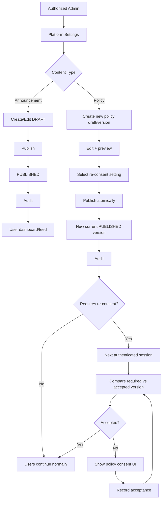

# Manage Platform Settings Flow

**System:** AISLEY  
**Feature:** Manage Platform Settings  
**Status:** Draft  
**Basis:** `Admin.md`, `app.md`, `specs.md`

## 1. Purpose

This file contains the sequence/state behavior for:

- announcement drafting/publishing
- announcement archive
- policy version publication
- re-consent activation
- user policy acceptance
- Audit Log and feed handoffs

## 2. Announcement Flow



Recommended lifecycle:

```text
DRAFT → PUBLISHED → ARCHIVED
```

Archive is optional but useful.

## 3. Announcement Publish Boundary

```text
PUBLISHED announcement
→ appears in dashboard/feed
```

Not:

```text
PUBLISHED announcement
→ automatically Push/SMS every user
```

Push Notification Management is separate.

## 4. Announcement Archive

If supported:



## 5. Policy Draft Flow



Policy types:

```text
Terms of Service
Privacy Policy
Internal Rules
```

## 6. Policy Publish Flow



Recommended:

```text
published version = immutable
```

Future edits create a new draft/version.

## 7. Re-Consent Activation

If:

```text
requires_reconsent = true
```

then:

```text
new published policy version
→ becomes required version
→ affected users do not need synchronous row updates
→ next authenticated session checks consent
```

## 8. User Re-Consent Check



Exact decline/blocking behavior is Open.

## 9. Role-Aware Consent

Example:

```text
alex@example.com + BUYER
alex@example.com + SELLER
```

If Buyer accepts:

```text
Buyer consent stored
Seller consent unchanged
```

Consent target:

```text
authenticated user_id
```

not email.

## 10. Multiple Required Policies

```text
Terms v3 requires consent
Privacy v5 requires consent
```

User flow:

```text
check outstanding versions
→ accept required version(s)
→ continue only according to selected blocking policy
```

Exact ordering is Open.

## 11. Consent Idempotency

```text
same user_id + same policy_version_id
→ repeated accept request
→ no inconsistent duplicate
```

## 12. Feed Handoff

```text
announcement publication commits
→ announcement query/feed cache invalidated
→ user dashboard/feed can retrieve published content
```

Feed failure does not roll back the durable published state.

## 13. Push Notification Handoff

Optional separate action:

```text
published announcement
→ Admin chooses Create Push Campaign
→ Push Notification Management
```

No automatic broadcast.

## 14. Audit Handoff

```text
announcement/policy mutation commits
→ safe Audit event
→ System Audit Logs stores:
   Admin actor
   content ID/version
   action
   before/after status
   requires_reconsent flag where applicable
   timestamp
```

Do not duplicate full policy bodies into Audit Logs by default.

## 15. Concurrent Publish



The system must never leave two ambiguous current versions.

## 16. Publication Failure

```text
validation/transaction fails
→ remain draft/unpublished
→ do not show user-facing published state
```

## 17. Re-Consent Processing Failure

Recommended durable model:

```text
published policy version
+ requires_reconsent
+ user consent records
```

Therefore a temporary queue/cache failure does not erase the requirement.

## 18. Complete Flow



## 19. Open Flow Decisions

The exact flow still depends on:

- announcement archive support
- published-announcement editing/revisions
- scheduling/expiry
- internal-rules visibility
- exact active-user definition
- which roles require policy consent
- re-consent blocking behavior
- decline behavior
- grace periods
- multiple-policy ordering
- policy rollback
- whether publication requires second-Admin approval
- user notification channels beyond the dashboard/feed
