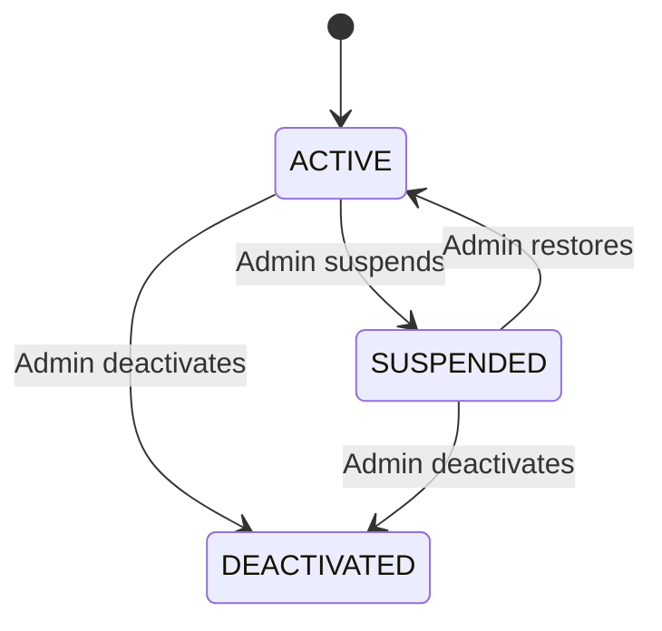
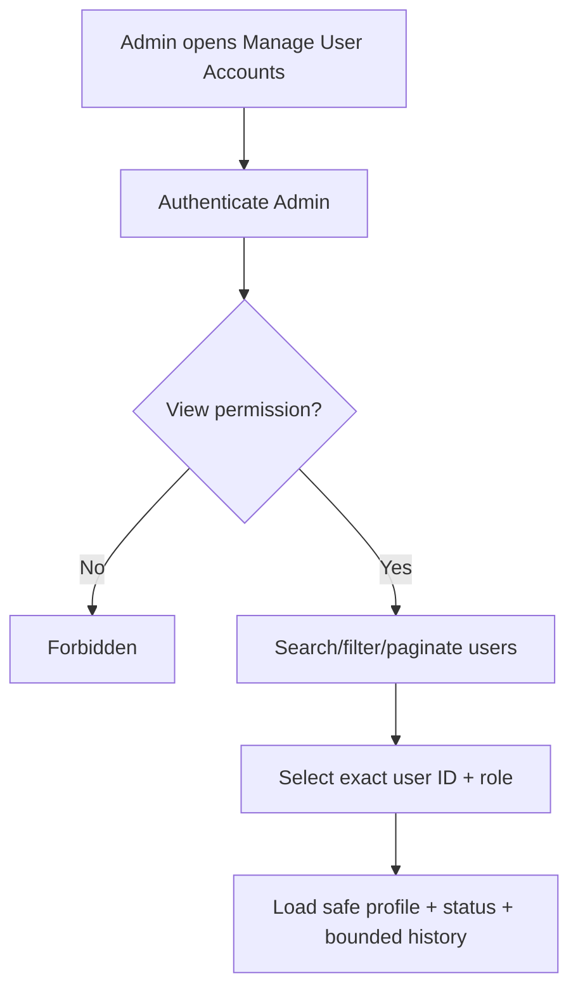
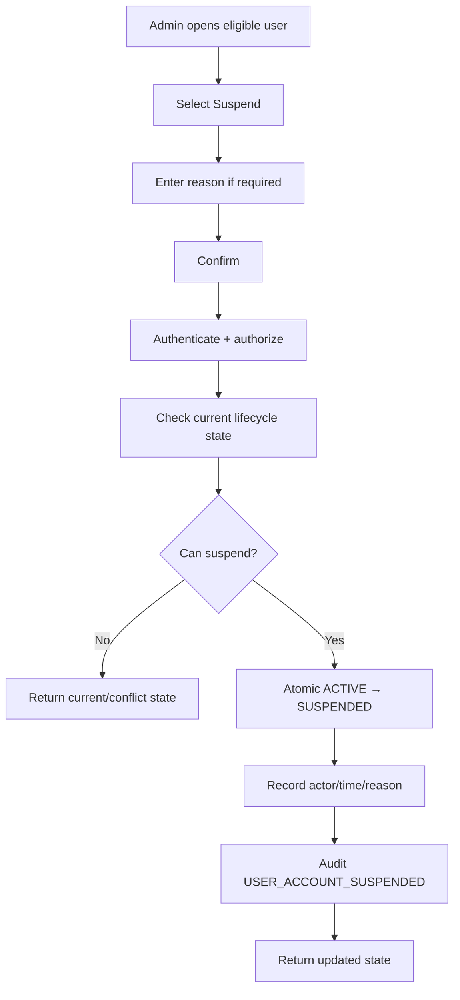
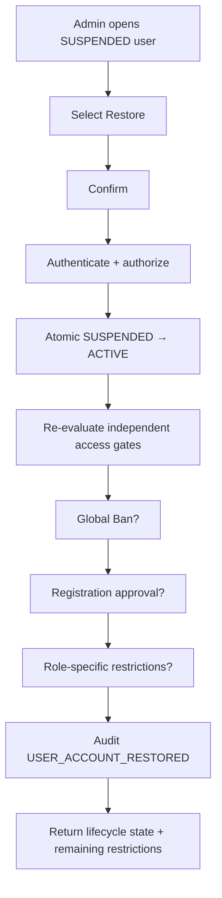
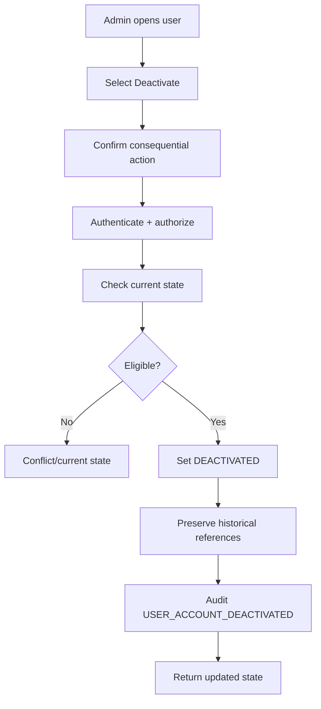
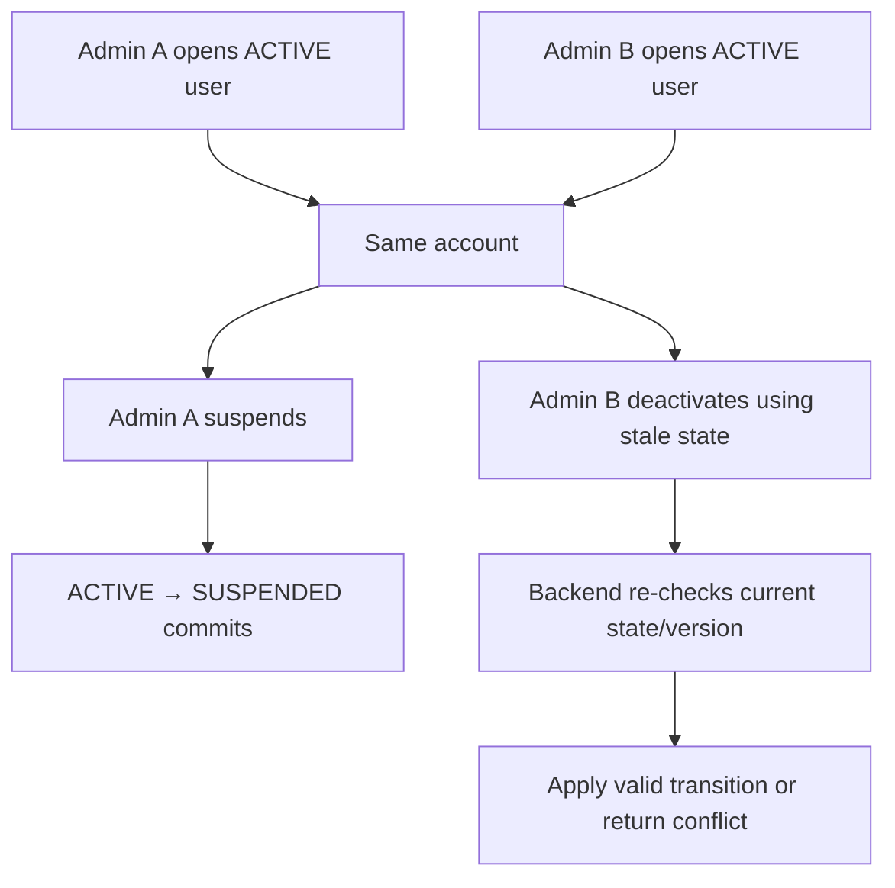
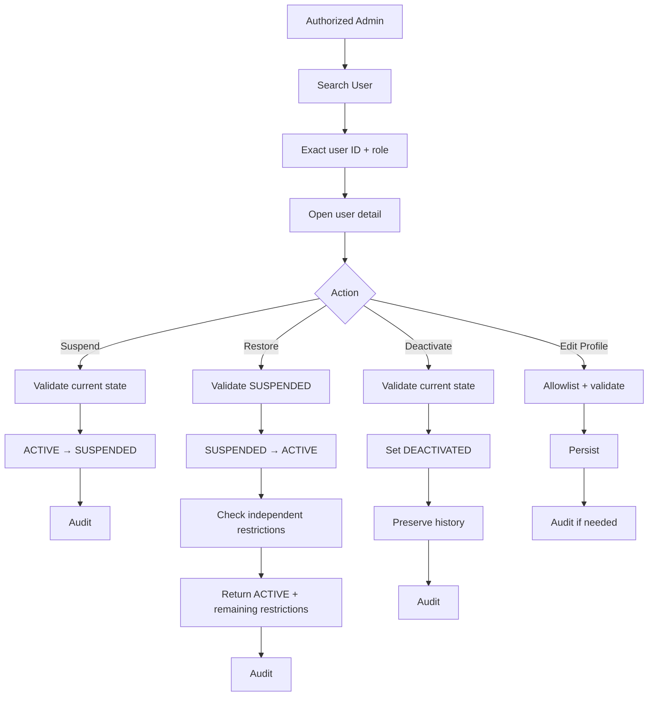

# Manage User Accounts Flow

**System:** AISLEY  
**Feature:** Manage User Accounts  
**Status:** Draft  
**Basis:** `Admin.md`, `app.md`, `specs.md`

## 1. Purpose

This file contains the sequence/state behavior for:

- account lookup/detail
- suspension
- restoration
- deactivation
- cross-feature restriction checks
- Audit Log handoff

## 2. Recommended Lifecycle



Reactivation from `DEACTIVATED` is Open.

## 3. User Lookup



## 4. Same Email Across Roles

```text
alex@example.com + BUYER
alex@example.com + SELLER

Admin selects SELLER user ID
→ mutations affect SELLER only
→ BUYER remains unchanged
```

## 5. Suspend



## 6. Restore



## 7. Restore Does Not Mean Full Access

Conceptually:

```text
Manage User Accounts
SUSPENDED → ACTIVE
```

Then evaluate:

```text
Global Ban
Seller Compliance
registration approval
Logistics subscription
Courier approval
```

Possible result:

```text
lifecycle = ACTIVE
effective access = still restricted
```

## 8. Seller Restore Example

```text
Seller lifecycle = SUSPENDED
Seller Compliance = RESTRICTED

Admin restores lifecycle
→ lifecycle = ACTIVE
→ Seller Compliance remains RESTRICTED
→ effective Seller access/actions remain limited
```

## 9. Global Ban Example

```text
account lifecycle = SUSPENDED
Global Ban = ACTIVE

Admin restores
→ lifecycle = ACTIVE
→ Global Ban stays ACTIVE
→ Blocklist middleware still denies access
```

## 10. Logistics Restore Example

```text
Logistics lifecycle = SUSPENDED
subscription = INACTIVE

Admin restores
→ lifecycle = ACTIVE
→ subscription remains INACTIVE
→ subscription requirements still apply
```

## 11. Courier Restore Example

```text
Courier lifecycle = SUSPENDED
Logistics approval = not valid / not approved

Admin restores
→ lifecycle = ACTIVE
→ Courier approval remains unchanged
→ Platform Admin does not override Logistics approval
```

## 12. Deactivate



No automatic:

```text
order cancellation
refund
shipment rewrite
Courier reassignment
```

## 13. Profile Update

```text
Admin edits allowed profile fields
→ backend authenticates/authorizes
→ target exact user ID
→ allowlist fields
→ validate
→ persist
→ Audit if consequential
```

Forbidden fields remain unchanged:

```text
role
password hash
Admin permissions
Global Ban
registration decision
subscription payment state
Seller Compliance state
```

## 14. Concurrent Mutation



No silent stale overwrite.

## 15. Manage Account Registrations Handoff

```text
PENDING / APPROVED / REJECTED
→ owned by Manage Account Registrations
```

Manage User Accounts may display the status but does not change the registration decision.

## 16. Global Ban Handoff

```text
User detail
→ view/link Global Ban state
→ explicit Global Ban feature action if authorized
```

Restore does not unban.

## 17. Seller Compliance Handoff

```text
Seller detail
→ view/link compliance state
→ Seller Compliance owns warnings/sanctions
```

Restore does not clear compliance.

## 18. Admin Chat Handoff

```text
User detail
→ Message User
→ exact role-aware Admin Chat thread
```

Messaging does not change lifecycle state.

## 19. Audit Handoff

```text
lifecycle/profile mutation commits
→ safe Audit event
→ System Audit Logs stores:
   Admin actor
   target user ID
   target role
   previous/new state
   safe reason
   timestamp
```

## 20. Effective Access Summary

```text
effective access
=
registration eligibility
+
account lifecycle
+
Global Ban state
+
role-specific restriction
+
role-specific subscription/approval requirements
```

This feature owns only the account-lifecycle component.

## 21. Complete Flow



## 22. Open Flow Decisions

The exact flow still depends on:

- exact status enum
- reactivation from DEACTIVATED
- suspension duration/expiry
- session/token invalidation on suspend/deactivate
- user notification channels
- in-flight order/shipment behavior
- support/chat access while restricted
- exact concurrency mechanism
