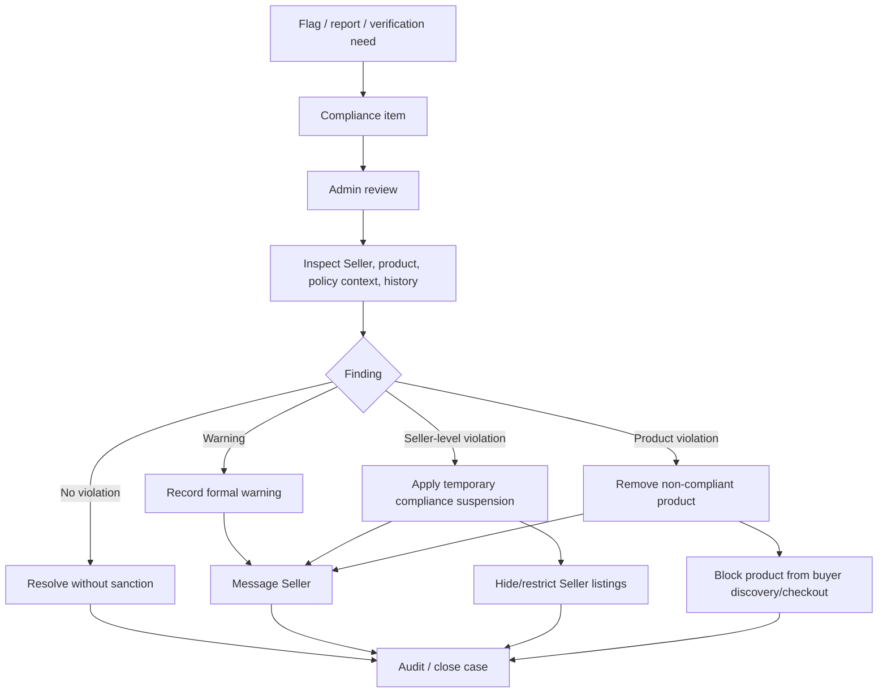
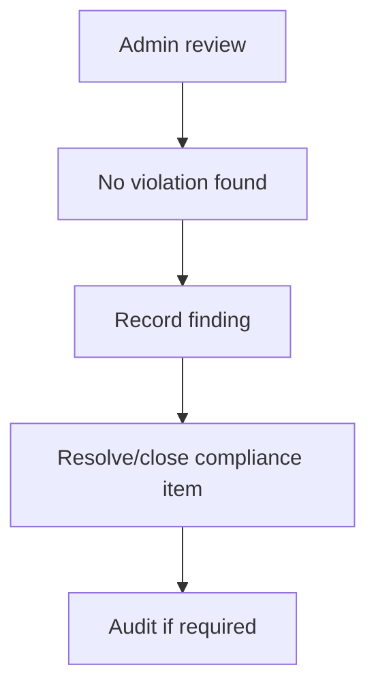
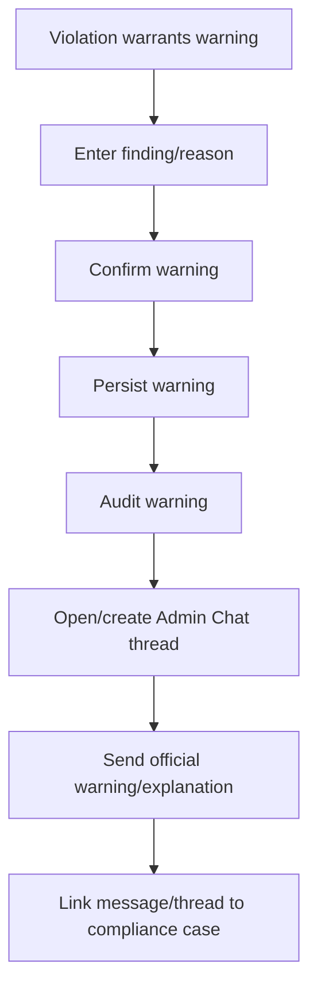
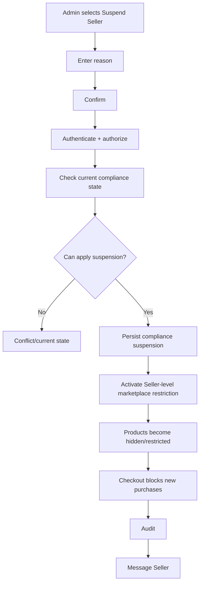
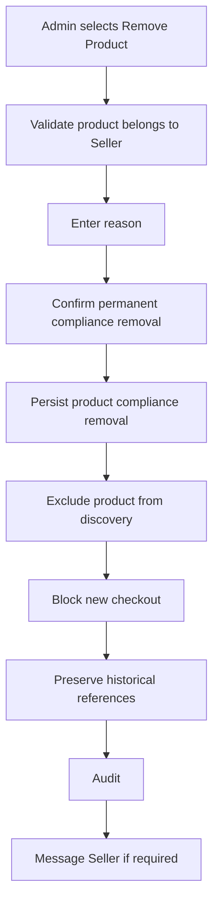
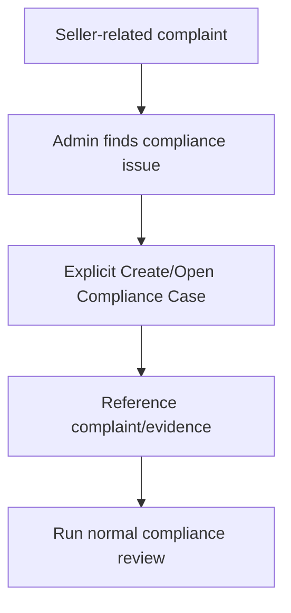
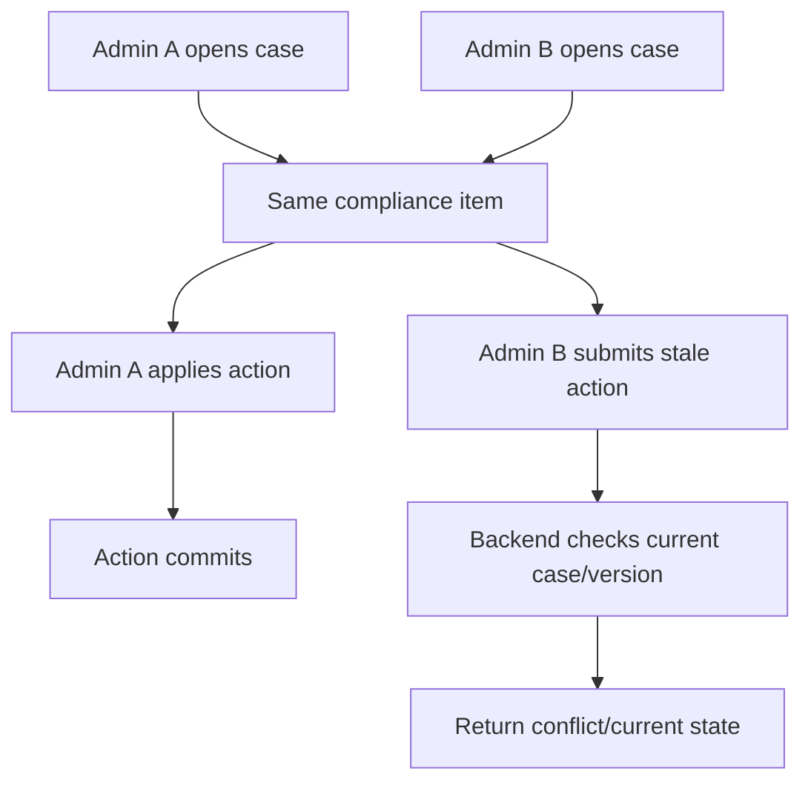
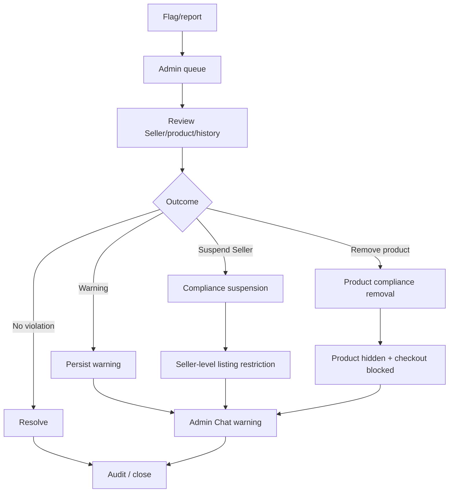

# Monitor Seller Compliance Flow

**System:** AISLEY  
**Feature:** Monitor Seller Compliance  
**Status:** Draft  
**Basis:** `Admin.md`, `Seller.md`, `app.md`, `specs.md`

## 1. Purpose

This file contains the sequence/state behavior for:

- internal flags/reports
- Seller/product review
- formal warning
- temporary compliance suspension
- permanent product removal
- no-violation resolution
- listing-visibility cascade
- Messaging and Audit handoffs

## 2. High-Level Flow



## 3. Compliance Review

```text
Admin opens actionable item
→ exact Seller user ID resolved
→ product ID resolved if applicable
→ review report/flag
→ inspect product
→ inspect Seller history
→ compare against platform policy
→ choose explicit outcome
```

## 4. No Violation



No Seller/product restriction is applied.

## 5. Warning



Messaging failure does not erase the committed warning.

## 6. Temporary Seller Compliance Suspension



## 7. Suspension Cascade

Recommended scalable model:

```text
Seller compliance_suspended = true
→ product/search query excludes Seller listings
→ product detail enforces restriction
→ cart/checkout validates restriction
```

This avoids requiring destructive deletion of all Seller products.

## 8. Existing Orders

```text
compliance suspension applied
→ existing order records remain unchanged
→ no automatic cancellation/refund
```

Operational handling is a separate policy decision.

## 9. Permanent Product Removal



Removing one product does not automatically suspend the Seller.

## 10. Vacation Mode Independence

```text
Vacation Mode = Seller-controlled
Compliance Suspension = Admin-controlled
```

Example:

```text
Vacation Mode ON
Compliance Suspension ON

Seller turns Vacation Mode OFF
→ Compliance Suspension remains ON
→ Listings remain restricted
```

## 11. Manage User Accounts Independence

```text
Account lifecycle SUSPENDED
+
Compliance SUSPENDED
```

If compliance restriction is removed:

```text
Account lifecycle remains SUSPENDED
```

## 12. Global Ban Independence

```text
Global Ban ACTIVE
+
Compliance SUSPENDED
```

If compliance restriction is removed:

```text
Global Ban remains ACTIVE
```

## 13. Complaint Handoff



Complaint does not automatically impose sanction.

## 14. Global Ban Handoff

If severity warrants separate security action:

```text
Compliance case
→ explicit Global Ban action
→ separate authorization/confirmation
→ Blocklist feature owns ban
```

## 15. Messaging Handoff

```text
compliance action commits
→ Admin Chat warning/explanation
→ thread/message reference linked to case
```

Message itself is not the authoritative sanction.

## 16. Audit Handoff

```text
warning / suspension / product removal / resolution
→ mutation commits
→ safe Audit event
→ System Audit Logs records:
   Admin actor
   Seller ID
   product ID if applicable
   case ID
   action
   timestamp
```

## 17. Dashboard Handoff

```text
new actionable compliance item
→ Dashboard Seller Compliance count increases

case resolved/non-actionable
→ count eventually decreases
```

Exact actionable definition belongs to this feature.

## 18. Concurrent Review



No silent stale overwrite.

## 19. Complete Flow



## 20. Open Flow Decisions

The exact flow still depends on:

- exact compliance-case statuses
- suspension duration/expiry
- Seller access while suspended
- existing-order fulfillment policy
- product reinstatement policy
- exact listing/search cascade implementation
- case assignment/priority/SLA
- Seller appeal/review process
- complaint-to-compliance handoff rules
- compliance-to-Global-Ban policy
