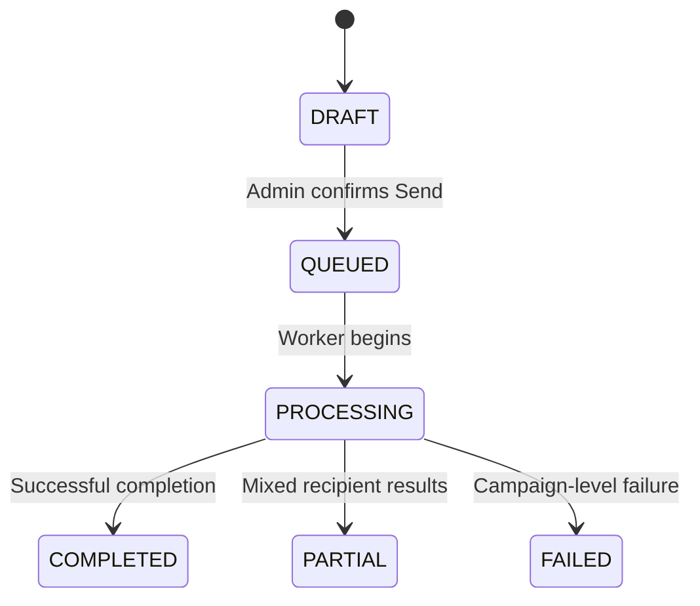
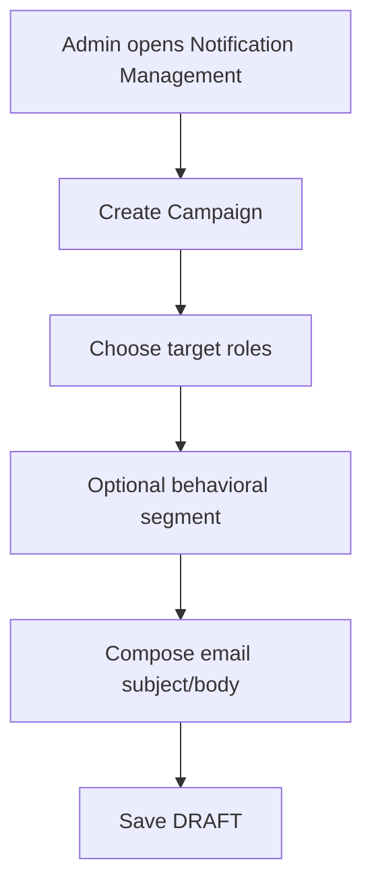
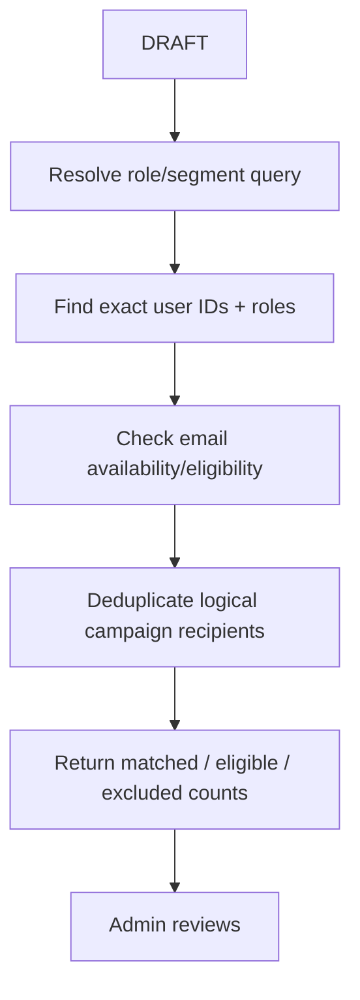
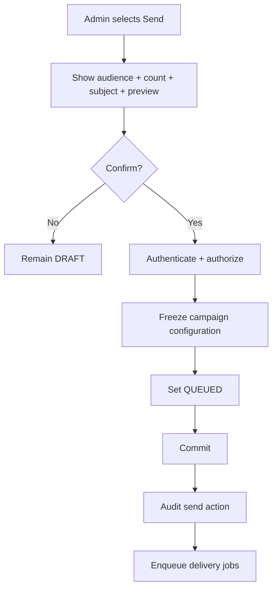
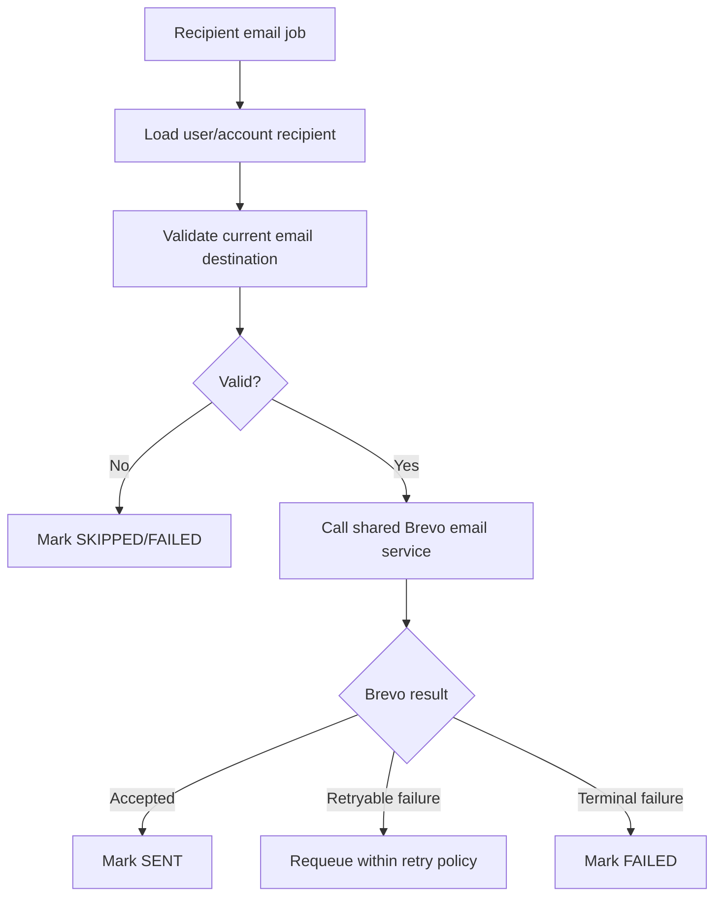
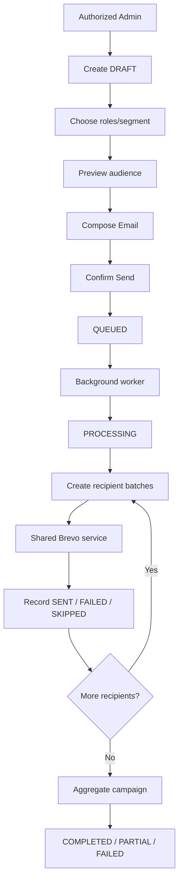

# Notification Management Flow

**System:** AISLEY  
**Feature:** Notification Management  
**Status:** Draft  
**MVP Channel:** Email via Brevo  
**Project Clarification:** Push/SMS are future extensions.

## 1. Purpose

This file contains the sequence/state behavior for:

- creating a targeted email notification campaign
- role/segment selection
- audience preview
- send confirmation
- queued/background email delivery
- Brevo handoff
- recipient results
- final campaign state

## 2. Recommended Lifecycle



## 3. Create Campaign



## 4. Audience Selection

Minimum:

```text
BUYER
SELLER
LOGISTICS
COURIER
ALL USERS
```

Optional:

```text
Inactive Buyers
Top-Performing Sellers
```

once definitions are configured.

## 5. Audience Preview



## 6. Same Email Across Roles

```text
alex@example.com + BUYER
alex@example.com + SELLER
```

AISLEY resolves both role-accounts independently.
Whether the physical mailbox receives one or two copies is an Open Decision.

## 7. Send Confirmation



## 8. Background Processing

```text
QUEUED
→ worker starts
→ PROCESSING
→ resolve/finalize recipients
→ split into bounded batches
→ send email jobs
```

## 9. Brevo Handoff



## 10. Brevo Is Only Delivery

Brevo does not decide:

```text
who belongs to Buyer
who is a Seller
which users are inactive
which campaign they receive
```

AISLEY resolves all targeting before the delivery call.

## 11. Batch Processing

```text
campaign recipients
→ batch 1
→ batch 2
→ batch 3
→ ...
```

Each batch can retry independently.

## 12. Invalid Recipient

```text
invalid/missing email
→ SKIPPED or FAILED
→ continue other recipients
```

## 13. Provider Failure

```text
Brevo temporary failure
→ retain campaign/recipient record
→ bounded retry
→ do not lose already successful recipient results
```

## 14. Final Aggregation

```text
while recipient jobs remain pending
→ campaign = PROCESSING
```

When terminal:

```text
successful according to policy
→ COMPLETED

mixed result
→ PARTIAL

campaign-level failure
→ FAILED
```

Exact thresholds remain Open.

## 15. Platform Announcement Handoff

Optional:

```text
Manage Platform Settings
→ published announcement
→ Admin selects Create Notification Campaign
→ content copied/referenced into DRAFT
→ Admin chooses audience
→ normal send flow
```

No automatic email blast.

## 16. Registration Email Boundary

```text
Manage Account Registrations
→ individual approval/rejection email
→ shared Brevo service
```

Those are transactional emails, not Notification Management campaigns.

## 17. Admin Notifications Boundary

Optional:

```text
campaign COMPLETED/FAILED
→ Admin Notifications
→ deep link to campaign
```

## 18. Audit Handoff

```text
campaign send commits
→ System Audit Logs
→ actor + campaign ID + target + count + timestamp
```

No Brevo credentials or full recipient list.

## 19. Complete Flow



## 20. Future Channel Extension

If AISLEY later adds:

```text
PUSH
SMS
```

the campaign/audience model may remain the same.
Only the delivery adapter changes:

```text
EMAIL → Brevo
PUSH → future provider/system
SMS → future provider/system
```

## 21. Open Flow Decisions

The exact flow still depends on:

- physical-email deduplication across role-accounts
- behavioral-segment definitions
- email preferences/consent
- queue technology
- batch size
- retry/backoff
- Brevo rate-limit behavior
- campaign cancellation
- scheduling
- completion/failure thresholds
