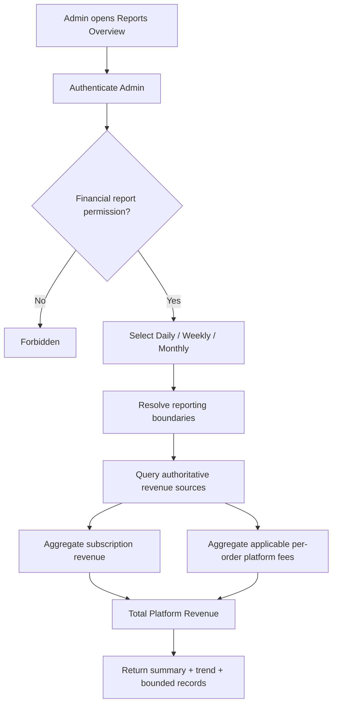
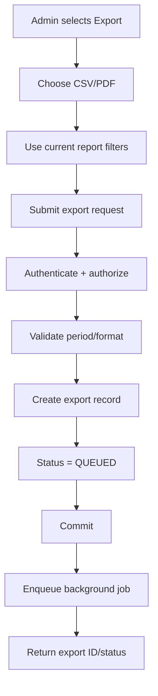
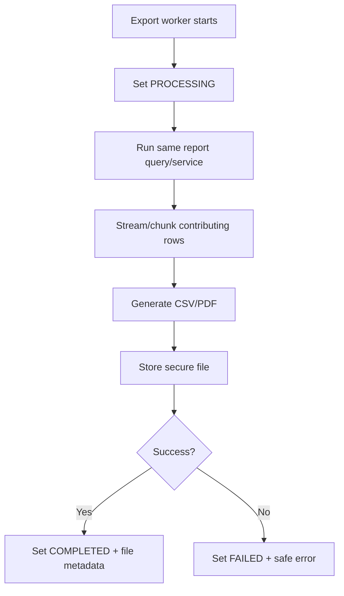
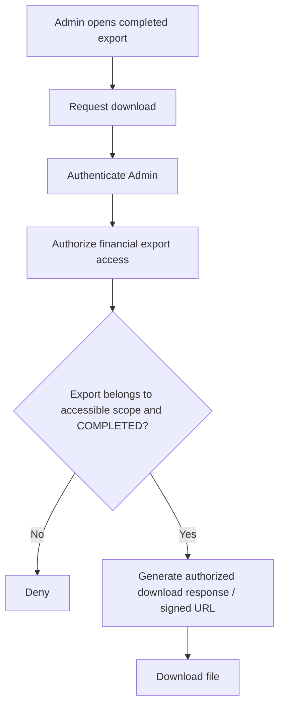
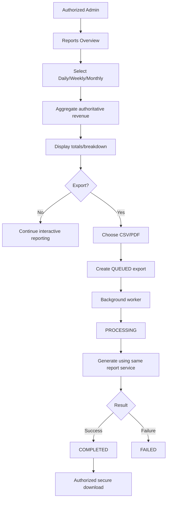

# Reports Overview Flow
**System:** AISLEY  
**Feature:** Reports Overview  
**Status:** Draft  
**Basis:** `Admin.md`, `app.md`, `specs.md`
## 1. Purpose
The main Reports Overview page is read/aggregation oriented.
This file exists primarily for the stateful asynchronous export path:
- report query
- export request
- queueing
- background generation
- completion/failure
- secure download
## 2. Interactive Report Query

## 3. Revenue Calculation
```text
Logistics subscription revenue
+
applicable per-order platform fee revenue
=
AISLEY Platform Revenue
```
Never include:
```text
default ₱50 shipping fee
```
## 4. Dashboard Handoff
```text
Dashboard Platform Commission
→ same PlatformRevenueReportService/calculation
→ same period/filter
→ same result subject to cache freshness
```
## 5. Export Request

The HTTP request does not wait for the full export.
## 6. Background Generation

## 7. Export State
Recommended:
```text
QUEUED
→ PROCESSING
→ COMPLETED
```
or:
```text
QUEUED
→ PROCESSING
→ FAILED
```
Exact state names are Open.
## 8. Export Consistency
```text
screen report filters
=
export filters
```
and:
```text
screen revenue logic
=
export revenue logic
```
Do not maintain a separate export formula.
## 9. Export Completion Notification
Optional:
```text
export COMPLETED/FAILED
→ Admin Notifications
→ deep link to export/report
```
This is recommended for long-running jobs but not source-required.
## 10. Secure Download

Possessing `exportId` or file URL is not sufficient authorization.
## 11. Export Failure
```text
generation fails
→ export = FAILED
→ no valid download
→ retain safe failure information
→ optional retry
```
## 12. Queue Failure
```text
export request validation succeeds
but queue insertion fails
→ do not claim export is processing successfully
→ return/recover with clear failed state
```
## 13. Large Dataset Handling
Recommended:
```text
query in chunks/stream
→ write export incrementally
→ avoid loading all financial records in memory
```
## 14. Audit Handoff
Recommended:
```text
export requested
→ safe Audit event

export downloaded
→ optional safe Audit event
```
Audit contains:
```text
Admin actor
export ID
format
period/filter
timestamp
```
not full report content.
## 15. Complete Flow

## 16. Open Flow Decisions
The exact flow still depends on:
- whether CSV and PDF are both MVP
- export queue technology
- export file storage
- export retry policy
- export retention/expiry
- Admin Notification on completion/failure
- download Audit logging
- exact revenue-recognition rules
