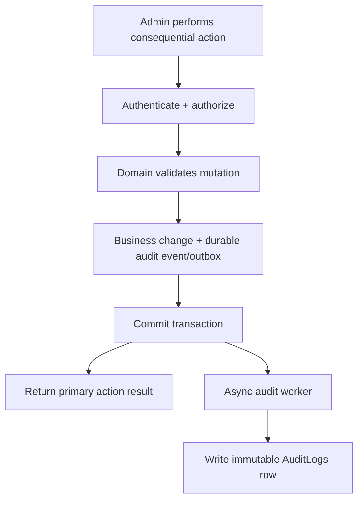
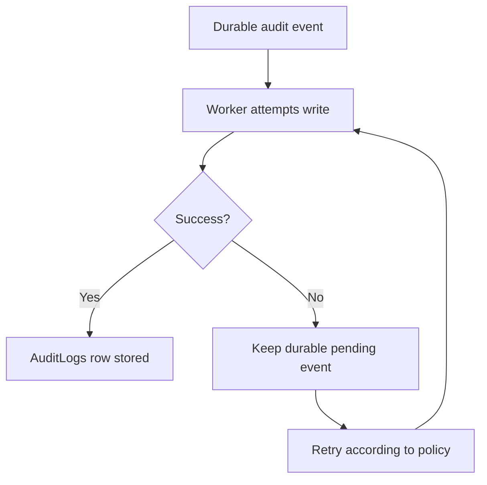
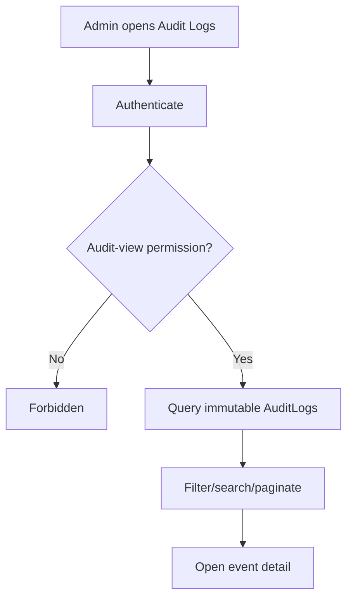
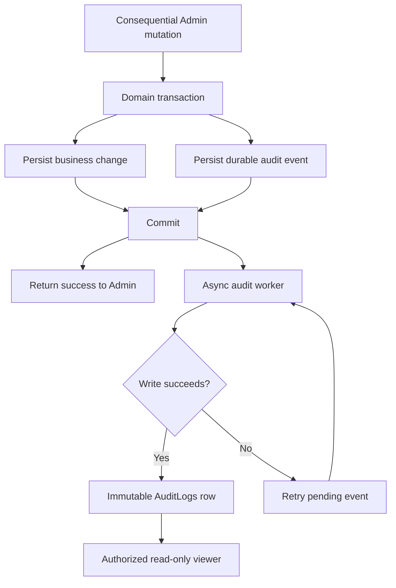

# System Audit Logs Flow

**System:** AISLEY  
**Feature:** System Audit Logs  
**Status:** Draft  
**MVP Storage:** Internal `AuditLogs` table  
**External Logging Service:** Optional

## 1. Purpose

This file contains the sequence behavior for:

- Admin mutation
- audit event creation
- asynchronous write
- retry/recovery
- immutable AuditLogs persistence
- Admin viewer retrieval

## 2. Main Write Flow



The Admin action does not wait for final AuditLogs persistence.

## 3. Why Durable Handoff Matters

The source requires:

```text
asynchronous write
without failing primary request
```

Recommended:

```text
business change
+
audit event/outbox record
commit together
```

Then:

```text
async worker
→ AuditLogs
```

This prevents temporary worker failure from silently losing the event.

## 4. Successful Mutation

Example:

```text
Admin suspends user
→ user state commits
→ USER_ACCOUNT_SUSPENDED event becomes durable
→ response returned
→ worker writes AuditLogs row
```

## 5. Failed Mutation

```text
Admin attempts suspension
→ domain validation fails
→ user state does not change
→ no success Audit event
```

A separate security/error log may capture the failure if required.

## 6. Audit Writer Failure



## 7. Primary Action Independence

Never:

```text
AuditLogs database temporarily unavailable
→ undo already committed account suspension
```

Instead:

```text
business action remains committed
→ audit event retries
```

## 8. Duplicate Retry

```text
same audit event retried
→ idempotency check
→ one logical AuditLogs record
```

Recommended identifier:

```text
event_id
```

## 9. Audit Record

Worker writes:

```text
actor_admin_id
event_type
source_feature
target_type
target_id
safe before/after
safe metadata
occurred_at
```

Never:

```text
password
token
OTP
API secret
payment secret
evidence binary
```

## 10. Viewer Flow



## 11. Viewer Is Read-Only

```text
Audit Logs viewer
→ list
→ search
→ filter
→ detail
```

Not:

```text
edit
delete
rewrite
```

## 12. Feature Handoff Examples

```text
Manage Account Registrations
→ ACCOUNT_REGISTRATION_APPROVED / REJECTED

Manage User Accounts
→ USER_ACCOUNT_SUSPENDED / RESTORED / DEACTIVATED

Seller Compliance
→ WARNING / SUSPENSION / PRODUCT_REMOVAL

Complaints
→ COMPLAINT_DECIDED

Platform Settings
→ ANNOUNCEMENT_PUBLISHED / POLICY_VERSION_PUBLISHED

Global Ban
→ BLOCKLIST_ENTRY_ADDED / DISABLED

Notification Management
→ NOTIFICATION_CAMPAIGN_QUEUED
```

## 13. High-Frequency Runtime Events

Do not route every runtime event through Audit Logs.
Example:

```text
blocked IP request
→ security/application log
```

But:

```text
Admin adds blocked IP
→ System Audit Log
```

## 14. External Logging Service

Current source permits:

```text
internal AuditLogs table
OR external logging service
```

MVP flow:

```text
Audit event
→ internal AuditLogs table
```

Optional future:

```text
AuditLogs/event stream
→ external SIEM/log archive
```

External forwarding must not become the only authoritative copy unless explicitly redesigned.

## 15. Complete Flow



## 16. Open Flow Decisions

The exact flow still depends on:

- middleware vs domain-event implementation details
- outbox schema
- queue technology
- retry/backoff
- dead-letter handling
- whether external SIEM forwarding is later added
- exact sensitive-read audit policy
