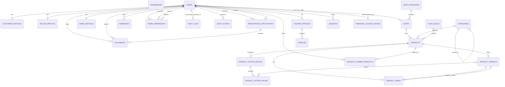

# Database Schema

> **Status:** Implemented foundation, customer-homepage, and product-detail schema
>
> **Last synchronized:** 2026-08-29
>
> **Database:** PostgreSQL 18.3
>
> **Source of truth:** `src/api/database/migrations/`

This document describes the schema that is currently implemented in `src/api`. It is not a target-state schema for every marketplace feature in `docs/requirements.md`. Tables that are still deferred are listed separately so planned entities are not mistaken for deployed database objects.

## 1. Scope and role boundary

The implemented authentication schema follows the repository-level `AGENTS.md` contract and supports four roles:

- `customer` — called Buyer in some product documents.
- `seller` — owns at most one shop.
- `admin` — reviews registrations and may receive custom permissions.
- `courier` — consumes API endpoints from an external mobile application.

`docs/requirements.md`, `docs/architecture.md`, and `docs/workspace.md` also describe Logistics as a fifth authenticating role and disagree about who approves Couriers. That conflict is unresolved. Consequently, the current schema has:

- no `logistics` value in `users.role`;
- no Logistics profile, company, hub, or subscription table; and
- a generic reviewer relationship intended for Admin use but not role-constrained by the database.

The role documents must be reconciled before introducing Logistics authentication or ownership relationships.

## 2. Database conventions

| Concern | Implemented convention |
| --- | --- |
| Application primary keys | PostgreSQL `UUID`, generated as UUIDv7 by Eloquent's `HasUuids` trait |
| Application foreign keys | `UUID` via Laravel `foreignUuid` |
| Sanctum tokens | UUID primary key and UUID polymorphic owner key |
| Enum-like values | PostgreSQL `VARCHAR`; strict values are PHP backed enums cast by Eloquent |
| Timestamps | Laravel `created_at` and `updated_at` columns unless noted otherwise |
| File storage | Database stores disk/path and metadata only; file bytes belong in configured blob storage |
| User deletion | Owned profile data generally cascades; reviewer/grantor references become `NULL`; a shop restricts seller deletion |
| Seller tenancy | A shop is linked directly to one seller user through `shops.seller_id`; seller-owned queries must derive tenant scope from the authenticated user |

Framework infrastructure tables retain the key types required by Laravel:

- `password_reset_tokens`, `sessions`, `cache`, `cache_locks`, and `job_batches` use natural/string keys.
- `jobs`, `failed_jobs`, and the migration repository use Laravel's numeric internal keys.
- These framework-only exceptions do not represent application-domain entities.

## 3. Implemented relationship map

The `PERSONAL_ACCESS_TOKENS` relationship is polymorphic rather than a database foreign key. The current authentication model uses `User` as its token owner.

## 4. Enum values

Every column in this section is stored as a string in PostgreSQL and cast to the listed PHP enum in its Eloquent model.

| PHP enum | Values | Used by |
| --- | --- | --- |
| `UserRole` | `customer`, `seller`, `admin`, `courier` | `users.role`, `registration_applications.application_type`, `password_reset_tokens.role` |
| `UserStatus` | `pending`, `active`, `rejected`, `suspended`, `deactivated` | `users.status` |
| `UserSex` | `male`, `female`, `non_binary`, `prefer_not_to_say` | Role-profile `sex` columns |
| `ApplicationStatus` | `pending`, `approved`, `rejected` | `registration_applications.status` |
| `DocumentType` | `government_id`, `business_registration`, `tax_document`, `drivers_license`, `vehicle_registration`, `proof_of_address`, `other` | `documents.type` |
| `DocumentStatus` | `pending`, `verified`, `rejected` | `documents.status` |
| `AddressType` | `shipping`, `billing`, `both` | `addresses.type` |
| `VehicleType` | `motorcycle`, `car`, `van` | `vehicles.type` |
| `VehicleStatus` | `active`, `inactive`, `maintenance` | `vehicles.status` |
| `ShopStatus` | `pending`, `active`, `suspended`, `deactivated` | `shops.status` |
| `CategoryStatus` | `active`, `archived` | `shop_categories.status`, `categories.status` |
| `ProductStatus` | `draft`, `active`, `archived` | `products.status` |
| `ProductVariantStatus` | `active`, `inactive` | `product_variants.status` |
| `HomepageCampaignPlacement` | `hero`, `hero_side` | `homepage_campaigns.placement` |
| `AdminAuditAction` | `registration.approved`, `registration.rejected`, `admin.login_succeeded` | New `audit_logs.action` and `audit_outbox.action` values |
| `AuditSourceFeature` | `account_approval`, `admin_authentication` | New `audit_logs.source_feature` and `audit_outbox.source_feature` values |

The database does not currently add `CHECK` constraints for these values. Request validation, model enum casts, and service-layer transition rules are responsible for rejecting invalid values. Audit-log reads intentionally tolerate action and feature strings that are unknown to the current application so historical events remain renderable after taxonomy changes.

## 5. Identity and authentication

### 5.1 `users`

**Model:** `App\Models\User`

All authenticating people share this table. Role-specific personal data lives in a separate profile table.

| Column | PostgreSQL type | Nullable | Default | Notes |
| --- | --- | --- | --- | --- |
| `id` | UUID | No | Eloquent UUIDv7 | Primary key |
| `email` | VARCHAR | No | — | Login identifier within a role |
| `email_verified_at` | TIMESTAMP | Yes | `NULL` | Email verification time |
| `password` | VARCHAR | No | — | Hashed by the Eloquent cast |
| `role` | VARCHAR | No | `customer` | Cast to `UserRole` |
| `status` | VARCHAR | No | `pending` | Cast to `UserStatus`; used for approval gating |
| `remember_token` | VARCHAR(100) | Yes | `NULL` | Laravel remember token |
| `created_at` | TIMESTAMP | Yes | `NULL` | Managed by Eloquent |
| `updated_at` | TIMESTAMP | Yes | `NULL` | Managed by Eloquent |

Constraints and indexes:

- Primary key: `id`.
- Unique: (`email`, `role`). The same email can be reused for different roles.
- Index: (`role`, `status`) for role-specific approval and account queues.

Model relationships:

- Zero or one `CustomerProfile`, `SellerProfile`, `CourierProfile`, and `AdminProfile` row.
- Many addresses, registration applications, and documents.
- Zero or one seller-owned shop.
- Many reviewed applications/documents.
- Many permissions through `admin_permissions`.
- Many Sanctum personal access tokens.

### 5.2 Role profiles

Each profile has a UUID primary key and a unique UUID `user_id`, enforcing at most one row in that profile table per user. Deleting the owning user cascades to the profile.

#### `customer_profiles`, `seller_profiles`, and `courier_profiles`

**Models:** `CustomerProfile`, `SellerProfile`, `CourierProfile`

| Column | PostgreSQL type | Nullable | Notes |
| --- | --- | --- | --- |
| `id` | UUID | No | Primary key |
| `user_id` | UUID | No | Unique FK → `users.id`; `ON DELETE CASCADE` |
| `first_name` | VARCHAR | No | Personal name |
| `last_name` | VARCHAR | No | Personal name |
| `middle_name` | VARCHAR | Yes | Optional middle name |
| `contact_number` | VARCHAR(32) | No | Contact number |
| `sex` | VARCHAR(32) | No | Cast to `UserSex` |
| `birth_date` | DATE | No | Source for the computed `age` accessor |
| `profile_photo_path` | VARCHAR(2048) | Yes | Blob-storage path |
| `created_at` | TIMESTAMP | Yes | Managed by Eloquent |
| `updated_at` | TIMESTAMP | Yes | Managed by Eloquent |

Additional relationships:

- `SellerProfile.shop` resolves the shop through the profile's `user_id`.
- `CourierProfile.vehicles` returns the Courier's registered vehicles.
- Age is calculated from `birth_date`; it is not stored as a column.

#### `admin_profiles`

**Model:** `AdminProfile`

The identity columns match the other role profiles except `contact_number`, `sex`, and `birth_date` are nullable. `user_id` remains unique and cascades on user deletion.

An Admin profile photo is stored on the configured Laravel filesystem (Azure Blob when `FILESYSTEM_DISK=azure`). The database stores only the generated object path and validated metadata: `profile_photo_disk`, `profile_photo_path`, `profile_photo_mime`, `profile_photo_size`, `profile_photo_width`, and `profile_photo_height`. These fields are nullable. The raw path is never returned to the Admin SPA; authenticated delivery uses the current-Admin profile-photo endpoint.

### 5.3 `personal_access_tokens`

**Model:** `App\Models\PersonalAccessToken`

This is a customized Laravel Sanctum table so both the token row and the polymorphic owner key are UUID-compatible.

| Column | PostgreSQL type | Nullable | Notes |
| --- | --- | --- | --- |
| `id` | UUID | No | Primary key; generated as UUIDv7 |
| `tokenable_type` | VARCHAR | No | Polymorphic model class |
| `tokenable_id` | UUID | No | Polymorphic owner identifier |
| `name` | TEXT | No | Device/token label |
| `token` | VARCHAR(64) | No | Unique hashed token |
| `abilities` | TEXT | Yes | Sanctum ability list |
| `last_used_at` | TIMESTAMP | Yes | Last token use |
| `expires_at` | TIMESTAMP | Yes | Optional expiry; indexed |
| `created_at` | TIMESTAMP | Yes | Managed by Eloquent |
| `updated_at` | TIMESTAMP | Yes | Managed by Eloquent |

Indexes:

- Unique: `token`.
- Composite morph index: (`tokenable_type`, `tokenable_id`).
- Index: `expires_at`.

There is no foreign key on `tokenable_id` because the relationship is polymorphic.

### 5.4 `sessions`

Laravel's database-session table uses a string session ID rather than a UUID model primary key.

| Column | PostgreSQL type | Nullable | Notes |
| --- | --- | --- | --- |
| `id` | VARCHAR | No | Primary key |
| `user_id` | UUID | Yes | FK → `users.id`; `ON DELETE SET NULL`; indexed |
| `ip_address` | VARCHAR(45) | Yes | IPv4/IPv6 address |
| `user_agent` | TEXT | Yes | Client user agent |
| `payload` | TEXT | No | Serialized session payload |
| `last_activity` | INTEGER | No | Indexed Unix timestamp |

### 5.5 `password_reset_tokens`

| Column | PostgreSQL type | Nullable | Notes |
| --- | --- | --- | --- |
| `email` | VARCHAR | No | Login email within the reset's role/domain |
| `role` | VARCHAR(32) | No | Role/domain discriminator; part of the composite primary key |
| `token` | VARCHAR | No | Hashed reset token |
| `created_at` | TIMESTAMP | Yes | Creation time |

The composite primary key is (`email`, `role`). This keeps password recovery isolated by application domain when the same normalized email belongs to more than one role.

## 6. Registration, documents, and addresses

### 6.1 `registration_applications`

**Model:** `RegistrationApplication`

| Column | PostgreSQL type | Nullable | Default | Notes |
| --- | --- | --- | --- | --- |
| `id` | UUID | No | Eloquent UUIDv7 | Primary key |
| `user_id` | UUID | No | — | FK → `users.id`; `ON DELETE CASCADE` |
| `application_type` | VARCHAR(32) | No | — | Cast to `UserRole` |
| `status` | VARCHAR(32) | No | `pending` | Cast to `ApplicationStatus` |
| `submitted_at` | TIMESTAMP | No | — | Submission time |
| `reviewer_id` | UUID | Yes | `NULL` | FK → `users.id`; `ON DELETE SET NULL` |
| `reviewed_at` | TIMESTAMP | Yes | `NULL` | Decision time |
| `rejection_reason` | TEXT | Yes | `NULL` | Populated for rejection |
| `created_at` | TIMESTAMP | Yes | `NULL` | Managed by Eloquent |
| `updated_at` | TIMESTAMP | Yes | `NULL` | Managed by Eloquent |

Constraints and indexes:

- Unique: (`user_id`, `application_type`).
- Index: (`status`, `submitted_at`).

A registration application may have many uploaded documents. The reviewer relationship is nullable so historical applications survive reviewer deletion.

### 6.2 `documents`

**Model:** `Document`

| Column | PostgreSQL type | Nullable | Default | Notes |
| --- | --- | --- | --- | --- |
| `id` | UUID | No | Eloquent UUIDv7 | Primary key |
| `user_id` | UUID | No | — | FK → `users.id`; `ON DELETE CASCADE` |
| `registration_application_id` | UUID | Yes | `NULL` | FK → `registration_applications.id`; `ON DELETE CASCADE` |
| `reviewer_id` | UUID | Yes | `NULL` | FK → `users.id`; `ON DELETE SET NULL` |
| `type` | VARCHAR(64) | No | — | Cast to `DocumentType` |
| `status` | VARCHAR(32) | No | `pending` | Cast to `DocumentStatus` |
| `disk` | VARCHAR | No | — | Laravel filesystem disk name |
| `path` | TEXT | No | — | Object/blob path |
| `original_name` | VARCHAR | No | — | Client filename metadata |
| `mime_type` | VARCHAR(127) | No | — | Media type metadata |
| `size_bytes` | BIGINT | No | — | File size |
| `checksum` | VARCHAR(128) | Yes | `NULL` | Optional integrity hash |
| `reviewed_at` | TIMESTAMP | Yes | `NULL` | Verification/rejection time |
| `rejection_reason` | TEXT | Yes | `NULL` | Populated for rejection |
| `created_at` | TIMESTAMP | Yes | `NULL` | Managed by Eloquent |
| `updated_at` | TIMESTAMP | Yes | `NULL` | Managed by Eloquent |

Indexes:

- (`user_id`, `type`).
- (`registration_application_id`, `status`).

Deleting a registration application deletes its attached document metadata. Deleting a reviewer only nulls the reviewer reference.

### 6.3 `addresses`

**Model:** `Address`

| Column | PostgreSQL type | Nullable | Default | Notes |
| --- | --- | --- | --- | --- |
| `id` | UUID | No | Eloquent UUIDv7 | Primary key |
| `user_id` | UUID | No | — | FK → `users.id`; `ON DELETE CASCADE` |
| `type` | VARCHAR(32) | No | `shipping` | Cast to `AddressType` |
| `label` | VARCHAR | Yes | `NULL` | Examples: Home, Office |
| `recipient_name` | VARCHAR | No | — | Delivery/billing recipient |
| `contact_number` | VARCHAR(32) | No | — | Recipient contact |
| `address_line_1` | VARCHAR | No | — | Primary street/building line |
| `address_line_2` | VARCHAR | Yes | `NULL` | Optional secondary line |
| `barangay` | VARCHAR | No | — | Philippine locality |
| `city_municipality` | VARCHAR | No | — | City or municipality |
| `province` | VARCHAR | No | — | Province |
| `region` | VARCHAR | No | — | Region |
| `postal_code` | VARCHAR(10) | No | — | Postal code |
| `country` | VARCHAR | No | `Philippines` | Country name |
| `latitude` | NUMERIC(10,7) | Yes | `NULL` | Optional map coordinate |
| `longitude` | NUMERIC(10,7) | Yes | `NULL` | Optional map coordinate |
| `is_default` | BOOLEAN | No | `false` | Default-address marker |
| `created_at` | TIMESTAMP | Yes | `NULL` | Managed by Eloquent |
| `updated_at` | TIMESTAMP | Yes | `NULL` | Managed by Eloquent |

Indexes:

- (`user_id`, `type`).
- (`user_id`, `is_default`).

The database does not yet enforce one default address per user/type. That invariant must be maintained transactionally by the address service.

## 7. Admin authorization

### 7.1 `permissions`

**Model:** `Permission`

| Column | PostgreSQL type | Nullable | Notes |
| --- | --- | --- | --- |
| `id` | UUID | No | Primary key |
| `name` | VARCHAR | No | Display name |
| `slug` | VARCHAR | No | Unique machine identifier |
| `description` | TEXT | Yes | Optional explanation |
| `created_at` | TIMESTAMP | Yes | Managed by Eloquent |
| `updated_at` | TIMESTAMP | Yes | Managed by Eloquent |

### 7.2 `admin_permissions`

**Model:** `AdminPermission` custom Eloquent pivot

| Column | PostgreSQL type | Nullable | Notes |
| --- | --- | --- | --- |
| `id` | UUID | No | Primary key generated as UUIDv7 |
| `admin_id` | UUID | No | FK → `users.id`; `ON DELETE CASCADE` |
| `permission_id` | UUID | No | FK → `permissions.id`; `ON DELETE CASCADE` |
| `granted_by` | UUID | Yes | FK → `users.id`; `ON DELETE SET NULL` |
| `created_at` | TIMESTAMP | Yes | Managed by Eloquent |
| `updated_at` | TIMESTAMP | Yes | Managed by Eloquent |

Unique constraint: (`admin_id`, `permission_id`).

The UUID custom pivot ensures `belongsToMany()->attach()` generates the required `id`. The API must verify that both `admin_id` and `granted_by` belong to active Admin users.

### 7.3 `audit_logs`

**Model:** `AuditLog`

This append-only table records security-relevant Admin decisions. The audited resource uses a polymorphic type/UUID pair so future Admin workflows can share the same ledger without adding nullable foreign keys for every resource type.

| Column | PostgreSQL type | Nullable | Notes |
| --- | --- | --- | --- |
| `id` | UUID | No | Primary key generated as UUIDv7 |
| `actor_id` | UUID | Yes | Historical Admin identifier; intentionally not a database FK |
| `actor_name` | VARCHAR | Yes | Immutable display-name snapshot for deleted/deactivated actors |
| `action` | VARCHAR(128) | No | Write paths use `AdminAuditAction`; readers tolerate historical values |
| `source_feature` | VARCHAR(64) | No | Event source; defaults to `account_approval` for pre-viewer rows |
| `auditable_type` | VARCHAR | No | Audited Eloquent model class |
| `auditable_id` | UUID | No | Audited resource identifier; no database FK because the relation is polymorphic |
| `target_snapshot` | JSON | Yes | Minimal target identity/context retained after target changes or deletion |
| `old_values` | JSON | Yes | Relevant state immediately before the action |
| `new_values` | JSON | Yes | Relevant state immediately after the action |
| `changed_fields` | JSON | Yes | Stable list of fields represented by the before/after values |
| `metadata` | JSON | Yes | Sanitized non-secret action context |
| `request_id` | VARCHAR(64) | Yes | Request/correlation identifier |
| `schema_version` | SMALLINT | No | Audit payload version; defaults to `1` |
| `occurred_at` | TIMESTAMP | Yes | Original business-event time, preserved across delayed persistence |
| `ip_address` | VARCHAR(45) | Yes | Request IP when available |
| `user_agent` | TEXT | Yes | Request user-agent when available |
| `created_at` | TIMESTAMP | No | Ledger persistence time; no `updated_at` column |

Indexes:

- (`action`, `created_at`).
- (`auditable_type`, `auditable_id`).
- (`source_feature`, `occurred_at`).
- (`actor_id`, `occurred_at`).
- `occurred_at`.
- `request_id`.

The Eloquent model rejects update and delete operations. PostgreSQL and SQLite triggers also reject direct database updates/deletes. `actor_id` is a soft historical reference rather than a foreign key because a database-level `ON DELETE SET NULL` would attempt to mutate this append-only table; `actor_name` preserves attribution if the User is later removed.

### 7.4 `audit_outbox`

**Model:** `AuditOutbox`

Account-registration decisions write one outbox event inside the same transaction as the application and user-status transition. Successful active-Admin logins write an Admin-authentication event after the secure session is established; the authenticated Admin is both actor and target. A queued, idempotent writer copies sanitized events into `audit_logs` after commit. A scheduled recovery command redispatches due unprocessed rows if queue dispatch or processing is interrupted.

| Column | PostgreSQL type | Nullable | Notes |
| --- | --- | --- | --- |
| `id` | UUID | No | Primary/event ID; reused as `audit_logs.id` to prevent duplicate ledger rows |
| `actor_id` | UUID | Yes | FK → `users.id`; `ON DELETE SET NULL` |
| `actor_name` | VARCHAR | Yes | Actor display-name snapshot |
| `action` | VARCHAR(128) | No | Audit action value |
| `source_feature` | VARCHAR(64) | No | Audit source feature |
| `auditable_type` | VARCHAR | No | Target Eloquent model class |
| `auditable_id` | UUID | No | Target identifier; no polymorphic database FK |
| `target_snapshot` | JSON | Yes | Sanitized target identity/context |
| `old_values`, `new_values` | JSON | Yes | Sanitized before/after state |
| `changed_fields` | JSON | Yes | Fields included in the state comparison |
| `metadata` | JSON | Yes | Sanitized non-secret action context |
| `request_id` | VARCHAR(64) | Yes | Request/correlation identifier |
| `schema_version` | SMALLINT | No | Payload version; defaults to `1` |
| `ip_address` | VARCHAR(45) | Yes | Request IP when available |
| `user_agent` | TEXT | Yes | Truncated request user agent |
| `occurred_at` | TIMESTAMP | No | Original business-event time |
| `attempts` | INTEGER | No | Persistence attempt count; defaults to `0` |
| `available_at` | TIMESTAMP | Yes | Earliest retry/dispatch time |
| `processed_at` | TIMESTAMP | Yes | Successful ledger persistence time |
| `last_error` | TEXT | Yes | Truncated latest processing error for recovery diagnostics |
| `created_at`, `updated_at` | TIMESTAMP | Yes | Managed by Eloquent |

Indexes: (`processed_at`, `available_at`) for recovery scans and (`auditable_type`, `auditable_id`) for target diagnostics.

## 8. Courier foundation

### 8.1 `vehicles`

**Model:** `Vehicle`

| Column | PostgreSQL type | Nullable | Default | Notes |
| --- | --- | --- | --- | --- |
| `id` | UUID | No | Eloquent UUIDv7 | Primary key |
| `courier_profile_id` | UUID | No | — | FK → `courier_profiles.id`; `ON DELETE CASCADE` |
| `plate_number` | VARCHAR | No | — | Unique vehicle plate |
| `type` | VARCHAR | No | `motorcycle` | Cast to `VehicleType` |
| `status` | VARCHAR | No | `active` | Cast to `VehicleStatus` |
| `make` | VARCHAR | Yes | `NULL` | Vehicle make |
| `model` | VARCHAR | Yes | `NULL` | Vehicle model |
| `capacity` | NUMERIC(10,2) | Yes | `NULL` | Capacity value; unit must be defined by API validation |
| `registration_document_path` | TEXT | Yes | `NULL` | Vehicle-registration object path |
| `created_at` | TIMESTAMP | Yes | `NULL` | Managed by Eloquent |
| `updated_at` | TIMESTAMP | Yes | `NULL` | Managed by Eloquent |

Constraints and indexes:

- Unique: `plate_number`.
- Index: (`courier_profile_id`, `status`).
- Index: `type`.

## 9. Seller and catalog foundation

### 9.1 `shop_categories`

**Model:** `ShopCategory`

This table classifies the Seller's business/shop. Each canonical Shop Category owns the allowed Product Categories through `categories.shop_category_id`.

| Column | PostgreSQL type | Nullable | Default | Notes |
| --- | --- | --- | --- | --- |
| `id` | UUID | No | Eloquent UUIDv7 | Primary key |
| `name` | VARCHAR | No | — | Display name |
| `slug` | VARCHAR | No | — | Unique route/filter key |
| `description` | TEXT | Yes | `NULL` | Optional description |
| `status` | VARCHAR | No | `active` | Cast to `CategoryStatus`; indexed |
| `position` | SMALLINT | No | `0` | Canonical Shop Category display order |
| `created_at` | TIMESTAMP | Yes | `NULL` | Managed by Eloquent |
| `updated_at` | TIMESTAMP | Yes | `NULL` | Managed by Eloquent |

### 9.2 `shops`

**Model:** `Shop`

| Column | PostgreSQL type | Nullable | Default | Notes |
| --- | --- | --- | --- | --- |
| `id` | UUID | No | Eloquent UUIDv7 | Primary key |
| `seller_id` | UUID | No | — | Unique FK → `users.id`; `ON DELETE RESTRICT` |
| `shop_category_id` | UUID | Yes | `NULL` | FK → `shop_categories.id`; `ON DELETE SET NULL` |
| `name` | VARCHAR | No | — | Shop name |
| `slug` | VARCHAR | No | — | Globally unique route key |
| `description` | TEXT | Yes | `NULL` | Shop description |
| `status` | VARCHAR | No | `active` | Cast to `ShopStatus` |
| `contact_email` | VARCHAR | Yes | `NULL` | Public/business contact |
| `contact_number` | VARCHAR | Yes | `NULL` | Public/business contact |
| `website` | VARCHAR | Yes | `NULL` | External site |
| `logo_path` | TEXT | Yes | `NULL` | Blob-storage path |
| `banner_path` | TEXT | Yes | `NULL` | Blob-storage path |
| `is_on_vacation` | BOOLEAN | No | `false` | Disables fulfillment in API rules |
| `vacation_message` | TEXT | Yes | `NULL` | Optional storefront message |
| `created_at` | TIMESTAMP | Yes | `NULL` | Managed by Eloquent |
| `updated_at` | TIMESTAMP | Yes | `NULL` | Managed by Eloquent |

Constraints and indexes:

- Unique: `seller_id`, enforcing one Seller user ↔ one Shop.
- Unique: `slug`.
- Index: `shop_category_id`.
- Index: (`status`, `is_on_vacation`).

The foreign key cannot verify that `seller_id` has the Seller role. The API must enforce the role, active approval state, ownership, and tenant scope. Seller deletion is restricted so a shop cannot become detached through a hard delete.

### 9.3 `categories`

**Model:** `Category`

This is the hierarchical catalog taxonomy used by storefront product discovery.

| Column | PostgreSQL type | Nullable | Default | Notes |
| --- | --- | --- | --- | --- |
| `id` | UUID | No | Eloquent UUIDv7 | Primary key |
| `parent_id` | UUID | Yes | `NULL` | Self-FK → `categories.id`; `ON DELETE SET NULL` |
| `shop_category_id` | UUID | Yes | `NULL` | FK → `shop_categories.id`; `ON DELETE SET NULL` |
| `name` | VARCHAR | No | — | Display name |
| `slug` | VARCHAR | No | — | Globally unique route/filter key |
| `description` | TEXT | Yes | `NULL` | Optional description |
| `image_disk` | VARCHAR | No | `public` | Filesystem disk containing the homepage image |
| `image_path` | TEXT | Yes | `NULL` | Category-card image path |
| `status` | VARCHAR | No | `active` | Cast to `CategoryStatus` |
| `position` | SMALLINT | No | `0` | Display order within the Shop Category |
| `created_at` | TIMESTAMP | Yes | `NULL` | Managed by Eloquent |
| `updated_at` | TIMESTAMP | Yes | `NULL` | Managed by Eloquent |

Constraints and indexes:

- Unique: `slug`.
- Index: (`parent_id`, `status`).
- Index: (`shop_category_id`, `status`).

Deleting a parent preserves its children and sets their `parent_id` to `NULL`. Deleting a Shop Category preserves Product Categories while clearing their Shop Category association. The canonical taxonomy seeder creates 14 Shop Categories and 83 associated Product Categories from `docs/references/seller-shop-catagories.md`. Cycle prevention belongs in application validation.

### 9.4 `products`

**Model:** `Product`

Products store both the storefront-card fields and the product-detail content. Options, variants, ordered media, and inventory records are normalized into the related tables below; order-time snapshots remain deferred.

| Column | PostgreSQL type | Nullable | Default | Notes |
| --- | --- | --- | --- | --- |
| `id` | UUID | No | Eloquent UUIDv7 | Primary key |
| `shop_id` | UUID | No | — | FK → `shops.id`; `ON DELETE RESTRICT` |
| `category_id` | UUID | Yes | `NULL` | FK → `categories.id`; `ON DELETE SET NULL` |
| `name` | VARCHAR | No | — | Searchable product/card title |
| `slug` | VARCHAR | No | — | Globally unique product route key |
| `short_description` | TEXT | Yes | `NULL` | Summary copy; excluded from homepage DTOs |
| `description_markdown` | TEXT | Yes | `NULL` | GFM product description for the detail page |
| `specifications` | JSONB | Yes | `NULL` | Product specification key/value data |
| `thumbnail_disk` | VARCHAR | No | `public` | Filesystem disk for the primary card image |
| `thumbnail_path` | TEXT | Yes | `NULL` | Primary product-card image path |
| `price` | NUMERIC(12,2) | No | — | Current regular selling price |
| `original_price` | NUMERIC(12,2) | Yes | `NULL` | Legitimate comparison price when higher than `price` |
| `stock_quantity` | BIGINT | No | `0` | Current aggregate stock for discovery eligibility |
| `average_rating` | NUMERIC(3,2) | Yes | `NULL` | Derived rating summary |
| `review_count` | BIGINT | No | `0` | Real persisted review count |
| `sold_count` | BIGINT | No | `0` | Real persisted completed-sale count used for MVP ranking |
| `badges` | JSON | Yes | `NULL` | Storefront-safe promotional badge identifiers |
| `is_promoted` | BOOLEAN | No | `false` | Rule-based discovery signal |
| `status` | VARCHAR | No | `draft` | Cast to `ProductStatus` |
| `published_at` | TIMESTAMP | Yes | `NULL` | Product is not publicly visible before this time |
| `created_at` | TIMESTAMP | Yes | `NULL` | Managed by Eloquent |
| `updated_at` | TIMESTAMP | Yes | `NULL` | Managed by Eloquent |

Indexes: (`status`, `stock_quantity`, `published_at`), (`category_id`, `status`), (`shop_id`, `status`), and (`sold_count`, `average_rating`).

Public storefront queries centrally require an active/published product, an active approved Seller, an active Shop, and a Shop that is not in vacation mode. Primary discovery and deal queries additionally require positive product stock.

### 9.5 Product options, variants, and media

#### `product_option_groups`

**Model:** `ProductOptionGroup`

| Column | PostgreSQL type | Nullable | Notes |
| --- | --- | --- | --- |
| `id` | UUID | No | Eloquent UUIDv7 primary key |
| `product_id` | UUID | No | FK → `products.id`; `ON DELETE CASCADE` |
| `name` | VARCHAR | No | Option label, such as Color or Size |
| `position` | INTEGER | No | Display order within the product |

Unique (`product_id`, `position`) maintains a stable group ordering. This model has no timestamps.

#### `product_option_values`

**Model:** `ProductOptionValue`

| Column | PostgreSQL type | Nullable | Notes |
| --- | --- | --- | --- |
| `id` | UUID | No | Eloquent UUIDv7 primary key |
| `option_group_id` | UUID | No | FK → `product_option_groups.id`; `ON DELETE CASCADE` |
| `value` | VARCHAR | No | Human-readable option value |
| `swatch_color` | VARCHAR(32) | Yes | Optional color swatch token |
| `swatch_image_path` | TEXT | Yes | Optional image swatch object path |
| `position` | INTEGER | No | Display order within the group |

Unique (`option_group_id`, `value`) prevents duplicate values; unique (`option_group_id`, `position`) maintains stable ordering. This model has no timestamps.

#### `product_variants`

**Model:** `ProductVariant`

| Column | PostgreSQL type | Nullable | Default | Notes |
| --- | --- | --- | --- | --- |
| `id` | UUID | No | Eloquent UUIDv7 | Primary key |
| `product_id` | UUID | No | — | FK → `products.id`; `ON DELETE CASCADE` |
| `sku` | VARCHAR | No | — | Globally unique Seller SKU |
| `price` | NUMERIC(12,2) | Yes | `NULL` | Overrides the parent product price when supplied |
| `original_price` | NUMERIC(12,2) | Yes | `NULL` | Overrides the parent comparison price when supplied |
| `stock_quantity` | BIGINT | No | `0` | Variant availability quantity |
| `status` | VARCHAR | No | `active` | Cast to `ProductVariantStatus` |
| `primary_media_id` | UUID | Yes | `NULL` | FK → `product_media.id`; `ON DELETE SET NULL` |
| `created_at`, `updated_at` | TIMESTAMP | Yes | `NULL` | Managed by Eloquent |

Indexes: (`product_id`, `status`) and `primary_media_id`.

#### `product_variant_option_values`

This timestamp-free pivot represents the option-value combination selected by a variant.

| Column | PostgreSQL type | Nullable | Notes |
| --- | --- | --- | --- |
| `product_variant_id` | UUID | No | FK → `product_variants.id`; `ON DELETE CASCADE` |
| `product_option_value_id` | UUID | No | FK → `product_option_values.id`; `ON DELETE CASCADE` |

Composite primary key: (`product_variant_id`, `product_option_value_id`).

#### `product_media`

**Model:** `ProductMedia`

| Column | PostgreSQL type | Nullable | Default | Notes |
| --- | --- | --- | --- | --- |
| `id` | UUID | No | Eloquent UUIDv7 | Primary key |
| `product_id` | UUID | No | — | FK → `products.id`; `ON DELETE CASCADE` |
| `product_variant_id` | UUID | Yes | `NULL` | FK → `product_variants.id`; `ON DELETE SET NULL` |
| `disk` | VARCHAR | No | `public` | Laravel filesystem disk name |
| `path` | TEXT | No | — | Object/blob path |
| `alt_text` | VARCHAR | Yes | `NULL` | Accessible image description |
| `position` | INTEGER | No | — | Ordered media position within the product |
| `created_at`, `updated_at` | TIMESTAMP | Yes | `NULL` | Managed by Eloquent |

Unique (`product_id`, `position`) maintains the product gallery ordering; (`product_variant_id`, `position`) supports variant-media retrieval. The `product_variants.primary_media_id` foreign key is created after this table to resolve the circular reference.

### 9.5A Inventory SKUs, balances, and movements

`inventory_skus` gives both base products and Product Variants one stable stock identity. A database check requires base SKUs to have no variant and variant SKUs to reference one. SKU codes and variant references are globally unique; records are retained when a product is archived.

`inventory_balances` stores one current balance per SKU with unsigned `on_hand`, `reserved`, and nullable `alert_threshold` quantities. PostgreSQL checks enforce `0 <= reserved <= on_hand`; available stock is derived as `on_hand - reserved`.

`inventory_movements` is the append-only stock ledger. Each movement records string-backed `movement_type`, signed on-hand/reserved deltas, resulting balances, optional reference and idempotency keys, the nullable acting User, reason, and creation time. Application models reject updates and deletes. Existing Product/Product Variant quantities are backfilled as opening balances and remain synchronized compatibility projections for the current storefront and Cart queries.

### 9.6 `homepage_campaigns`

**Model:** `HomepageCampaign`

| Column | PostgreSQL type | Nullable | Default | Notes |
| --- | --- | --- | --- | --- |
| `id` | UUID | No | Eloquent UUIDv7 | Primary key |
| `placement` | VARCHAR(32) | No | — | Cast to `HomepageCampaignPlacement` |
| `title` | VARCHAR | No | — | Internal/display campaign title |
| `image_disk` | VARCHAR | No | `public` | Filesystem disk for banner media |
| `image_desktop_path` | TEXT | No | — | Desktop banner image path |
| `image_mobile_path` | TEXT | No | — | Mobile banner image path |
| `alt_text` | VARCHAR | No | — | Accessible image alternative |
| `destination_url` | TEXT | No | — | Sanitized against internal/allowed storefront hosts at output |
| `starts_at` | TIMESTAMP | No | — | Inclusive campaign start |
| `ends_at` | TIMESTAMP | No | — | Exclusive campaign end |
| `priority` | INTEGER | No | `0` | Higher values render first |
| `is_active` | BOOLEAN | No | `true` | Developer/admin operational switch |
| `created_at` | TIMESTAMP | Yes | `NULL` | Managed by Eloquent |
| `updated_at` | TIMESTAMP | Yes | `NULL` | Managed by Eloquent |

Only active records satisfying `starts_at <= now < ends_at` are exposed. Homepage caching is invalidated on normal model saves/deletes, and expiry is rechecked after cache retrieval.

### 9.7 `flash_deals` and `flash_deal_products`

**Model:** `FlashDeal`; products use an Eloquent many-to-many relationship.

`flash_deals` stores the named, server-authoritative deal window (`starts_at`, `ends_at`, and `is_active`). `flash_deal_products` uses (`flash_deal_id`, `product_id`) as its composite primary key and stores `deal_price NUMERIC(12,2)`, `deal_stock BIGINT`, `sold_quantity BIGINT`, and timestamps.

Both foreign keys cascade on delete. The homepage exposes a deal only during its active window and only when at least one attached product is storefront-purchasable, has remaining deal stock, and has a deal price below its regular price.

### 9.8 `recently_viewed_products`

**Model:** `RecentlyViewedProduct`

| Column | PostgreSQL type | Nullable | Notes |
| --- | --- | --- | --- |
| `id` | UUID | No | Eloquent UUIDv7 primary key |
| `user_id` | UUID | No | FK → `users.id`; `ON DELETE CASCADE` |
| `product_id` | UUID | No | FK → `products.id`; `ON DELETE CASCADE` |
| `last_viewed_at` | TIMESTAMP | No | Most recent authenticated view time |
| `created_at` | TIMESTAMP | Yes | Managed by Eloquent |
| `updated_at` | TIMESTAMP | Yes | Managed by Eloquent |

Unique (`user_id`, `product_id`) deduplicates repeated views. Index (`user_id`, `last_viewed_at`) supports most-recent-first retrieval. The API only personalizes with this data when the authenticated identity is an active Customer.

### 9.9 `carts` and `cart_items`

**Models:** `Cart`, `CartItem`

`carts` provides one persistent active Cart per Customer.

| Column | PostgreSQL type | Nullable | Notes |
| --- | --- | --- | --- |
| `id` | UUID | No | Eloquent UUIDv7 primary key |
| `customer_id` | UUID | No | Unique FK → `users.id`; `ON DELETE CASCADE` |
| `created_at`, `updated_at` | TIMESTAMP | Yes | Managed by Eloquent |

`cart_items` stores one Product configuration per line. Prices, option labels, and availability are deliberately not snapshotted; the Customer Cart API resolves their current authoritative values from the catalog on every response.

| Column | PostgreSQL type | Nullable | Notes |
| --- | --- | --- | --- |
| `id` | UUID | No | Eloquent UUIDv7 primary key |
| `cart_id` | UUID | No | FK → `carts.id`; `ON DELETE CASCADE` |
| `product_id` | UUID | No | FK → `products.id`; `ON DELETE CASCADE` |
| `variant_id` | UUID | Yes | FK → `product_variants.id`; `ON DELETE CASCADE`; `NULL` only for products without variants |
| `quantity` | INTEGER | No | Positive requested quantity, enforced by the API |
| `created_at`, `updated_at` | TIMESTAMP | Yes | Managed by Eloquent |

PostgreSQL/SQLite partial unique indexes enforce one line per purchasable configuration: (`cart_id`, `product_id`, `variant_id`) where `variant_id IS NOT NULL`, and (`cart_id`, `product_id`) where `variant_id IS NULL`. Indexes on (`cart_id`, `created_at`) and (`product_id`, `variant_id`) support ordered Customer projection and catalog-reference lookups.

## 10. Framework infrastructure tables

These tables are created by the Laravel foundation migrations and do not have application-domain Eloquent models.

| Table | Primary/key strategy | Purpose |
| --- | --- | --- |
| `cache` | String `key` primary key | Database cache entries; `expiration` indexed |
| `cache_locks` | String `key` primary key | Atomic cache locks; `expiration` indexed |
| `jobs` | Auto-incrementing BIGINT `id` | Database queue; `queue` indexed |
| `job_batches` | String `id` primary key | Batch queue state |
| `failed_jobs` | Auto-incrementing BIGINT `id`; unique string `uuid` | Failed queue payloads; (`connection`, `queue`, `failed_at`) indexed |
| `migrations` | Laravel-managed numeric ID | Records applied migrations and batches |

Numeric IDs in `jobs`, `failed_jobs`, and the migration repository are intentional framework exceptions to the application UUID rule.

## 11. Foreign-key delete behavior

| Child relationship | On parent delete | Reason |
| --- | --- | --- |
| Role profile → User | `CASCADE` | Profile has no meaning without its authenticating user |
| Registration application → applicant User | `CASCADE` | Application belongs to applicant |
| Registration application → reviewer User | `SET NULL` | Preserve review history if reviewer is removed |
| Document → User | `CASCADE` | Document metadata belongs to user |
| Document → registration application | `CASCADE` | Attached application documents follow the application |
| Document → reviewer User | `SET NULL` | Preserve verification metadata |
| Address → User | `CASCADE` | Address belongs to user |
| Admin permission → admin/permission | `CASCADE` | Grant is invalid without either side |
| Admin permission → grantor User | `SET NULL` | Preserve the grant after grantor removal |
| Audit log → actor User | No database FK | Preserve immutable actor ID/name snapshots without an FK-triggered ledger update |
| Audit outbox → actor User | `SET NULL` | Pending/recoverable event remains valid after actor removal |
| Vehicle → Courier profile | `CASCADE` | Vehicle registration belongs to Courier profile |
| Shop → Seller User | `RESTRICT` | Prevent a hard delete from orphaning the tenant |
| Shop → shop category | `SET NULL` | Preserve shop if classification is removed |
| Category → parent category | `SET NULL` | Preserve child categories if parent is removed |
| Product → Shop | `RESTRICT` | Products must be archived/removed before hard-deleting their tenant Shop |
| Product → Category | `SET NULL` | Preserve product if taxonomy is reorganized |
| Product option group → Product | `CASCADE` | Options have no meaning without their product |
| Product option value → Option group | `CASCADE` | Values have no meaning without their option group |
| Product variant → Product | `CASCADE` | Variants have no meaning without their product |
| Variant option value → Variant/option value | `CASCADE` | A selection cannot survive either side's removal |
| Product media → Product | `CASCADE` | Gallery media belongs to its product |
| Product media → Variant | `SET NULL` | Preserve product-gallery media if a variant is removed |
| Variant primary media → Product media | `SET NULL` | Keep the variant if its selected media is removed |
| Flash deal item → Flash deal/Product | `CASCADE` | Deal membership has no meaning without either side |
| Recently viewed item → User/Product | `CASCADE` | History has no meaning without either side |
| Cart → Customer User | `CASCADE` | A Cart belongs exclusively to its authenticating Customer |
| Cart item → Cart/Product/Variant | `CASCADE` | A Cart line cannot survive its Cart or selected catalog configuration |
| Session → User | `SET NULL` | Session record may outlive user cleanup briefly |

## 12. Application-enforced invariants

The current foreign keys guarantee referential integrity, but they cannot encode every role or workflow rule. The API layer must enforce all of the following:

1. A user may only have the profile corresponding to `users.role`, even though the database has one independent uniqueness constraint per profile table.
2. `registration_applications.application_type` must match the applicant's role and may not be `admin` for public registration.
3. Only an authorized active Admin may review registration applications/documents or grant Admin permissions.
4. User status and application status must change atomically during approval/rejection.
5. Seller and Courier access is gated by `users.status = active`.
6. `shops.seller_id` must reference a Seller user, and every seller-owned query must derive the shop from the authenticated Seller rather than trust a client-provided `shop_id`.
7. Email addresses should be normalized to lowercase before persistence because PostgreSQL's ordinary unique index is case-sensitive.
8. Only one address should be marked default for a given user and applicable address type; updates should occur transactionally.
9. Vehicle capacity must be nonnegative and use one API-defined unit.
10. Category ancestry must not contain cycles.
11. Enum transitions and values must be validated before persistence because the database columns are strings without native enum or `CHECK` constraints.
12. Hard deletion should not replace account suspension/deactivation workflows.
13. Product prices, stock, ratings, counts, and deal quantities must remain nonnegative; deal price must be below regular price before storefront exposure.
14. Homepage campaign windows must end after they start, and campaign destinations must remain internal or use explicitly allowed storefront hosts.
15. `recently_viewed_products.user_id` must identify a Customer even though the foreign key cannot enforce a user role.
16. Audit logs are append-only at both the Eloquent and database-trigger layers; normal application paths may create them but must not update or delete them.
17. Audit payloads must pass through the sanitizer and must not contain credentials, authorization/session material, raw evidence or binary file contents.
18. An audit outbox row must be committed with its business transition. Only the post-commit writer creates the ledger row, and retries must reuse the outbox UUID to remain idempotent.
19. Only successful active-Admin logins generate `admin.login_succeeded`; failed, inactive, and non-Admin authentication attempts do not generate that event.
20. A variant's selected option values must belong to option groups of that variant's product; the composite pivot cannot enforce this cross-table tenancy constraint.
21. A variant's `primary_media_id` and a media row's optional `product_variant_id` must refer to records for the same product; application writes must preserve this relationship.
22. Product, variant, and option ordering positions must be nonnegative and product/variant prices and stock quantities must remain nonnegative.
23. `carts.customer_id` must identify an active Customer for Cart access, and every Cart query/mutation must derive ownership from the authenticated Customer rather than client input.
24. A Cart Item with Product options must reference one active, complete Variant combination belonging to that Product; a Product without options must use `variant_id = NULL`.
25. Cart quantities must be positive and within current Product/Variant stock when mutated. Cart writes do not reserve or decrement inventory, and reads preserve unavailable intent while reporting current availability.
26. Seller registration creates its pending User, profile, default manual business address, pending one-to-one Shop, Registration Application, and two private evidence records as one logical operation; failed persistence must remove any blobs already written.
27. A Seller approval/rejection must transition the User, Registration Application, Shop, and attached evidence statuses atomically. Registration evidence is private and may be downloaded only by an authorized registration reviewer.
28. Seller registration accepts manually entered address components only; latitude, longitude, third-party place identifiers, and client-selected account/shop statuses are prohibited.

## 13. Migration order

Migrations currently run in this dependency order:

1. `0001_01_01_000000_create_users_table.php` — `users`, `password_reset_tokens`, `sessions`.
2. `0001_01_01_000001_create_cache_table.php` — `cache`, `cache_locks`.
3. `0001_01_01_000002_create_jobs_table.php` — `jobs`, `job_batches`, `failed_jobs`.
4. `2026_08_13_091901_create_personal_access_tokens_table.php`.
5. `2026_08_27_000100_create_customer_profiles_table.php`.
6. `2026_08_27_000101_create_seller_profiles_table.php`.
7. `2026_08_27_000102_create_courier_profiles_table.php`.
8. `2026_08_27_000103_create_admin_profiles_table.php`.
9. `2026_08_27_000104_create_registration_applications_table.php`.
10. `2026_08_27_000105_create_documents_table.php`.
11. `2026_08_27_000106_create_addresses_table.php`.
12. `2026_08_27_000107_create_permissions_table.php`.
13. `2026_08_27_000108_create_admin_permissions_table.php`.
14. `2026_08_27_000110_create_vehicles_table.php`.
15. `2026_08_27_000111_create_shop_categories_table.php`.
16. `2026_08_27_000112_create_shops_table.php`.
17. `2026_08_27_000113_create_categories_table.php`.
18. `2026_08_27_000114_scope_password_reset_tokens_by_role.php`.
19. `2026_08_28_000115_add_homepage_media_to_categories_table.php`.
20. `2026_08_28_000115_create_audit_logs_table.php`.
21. `2026_08_28_000116_create_products_table.php`.
22. `2026_08_28_000116_enrich_audit_logs_for_viewer.php`.
23. `2026_08_28_000117_create_audit_outbox_table.php`.
24. `2026_08_28_000117_create_homepage_campaigns_table.php`.
25. `2026_08_28_000118_create_flash_deals_tables.php`.
26. `2026_08_28_000118_make_audit_logs_append_only.php`.
27. `2026_08_28_000119_create_recently_viewed_products_table.php`.
28. `2026_08_28_000119_stabilize_audit_append_only_function.php`.
29. `2026_08_29_000120_add_product_details_and_variants.php` — product detail content, options, variants, variant selections, and media.
30. `2026_08_29_000121_create_carts_and_cart_items.php` — one Customer Cart, SKU-level Cart Items, and PostgreSQL-safe partial configuration uniqueness.
31. `2026_08_30_000122_link_product_categories_to_shop_categories.php` — associates each Product Category with its Shop Category taxonomy group.
32. `2026_08_30_000123_create_inventory_ledger.php` — SKU identities, current balances, immutable movements, constraints, and catalog-stock backfill.
33. `2026_08_30_000124_add_admin_profile_photo_metadata.php` — configured-disk and validated image metadata for private Admin profile photos.

## 14. Deferred schema

The following capabilities appear in requirements but have no migrations or models yet. Their names below are capability groupings, not approved table definitions.

| Capability | Deferred data design |
| --- | --- |
| Catalog and inventory | Order-driven reservation/release/fulfillment integration beyond the implemented Seller catalog, SKU balances, manual adjustments, thresholds, and movement ledger |
| Promotions | Seller/platform vouchers, general discount rules, eligibility, limits, and redemptions beyond the implemented homepage flash-deal windows |
| Checkout | Checkout selection/grouping for multi-shop purchases; Cart persistence is implemented |
| Orders and finance | Shop-scoped orders, immutable order-item/address snapshots, payments, fees, commissions, and status history |
| First-party logistics | Organization/hub decision, shipments/parcels, waybills, scan events, pickup/final-delivery tasks, assignments, proof of delivery, and Courier earnings |
| Reviews | Verified-purchase ratings, review media, and Seller responses |
| Support and compliance | Complaints/disputes, evidence, resolutions, warnings, and moderation actions |
| Messaging and notifications | Conversations, participants, messages, read state, and persisted notifications |
| Admin content | Announcements, policies, settings, and policy consent |
| Reporting | Derived Seller/Admin aggregates; avoid report tables until query performance requires them |

Before adding these tables:

- resolve the four-role versus five-role Logistics conflict;
- keep every application model primary key and relationship key UUID-based;
- keep enum-like columns as strings with PHP enum casts;
- preserve mutable product, price, and address data as order-time snapshots;
- ensure every Seller-owned resource resolves to a shop for tenant isolation; and
- update this document and `docs/PROGRESS.md` in the same change as the migrations.
